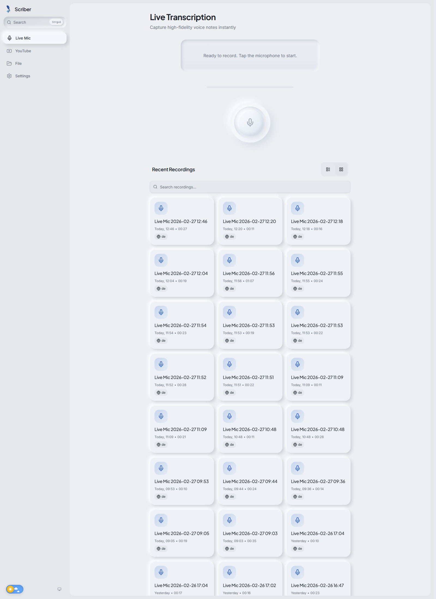
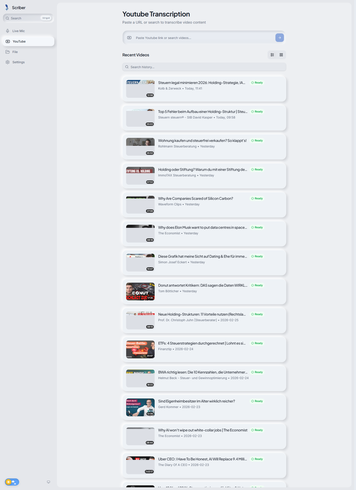
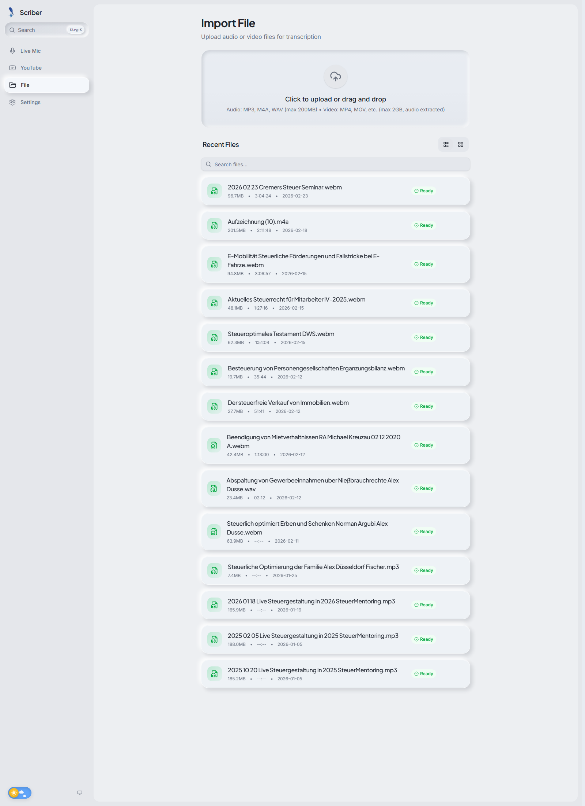
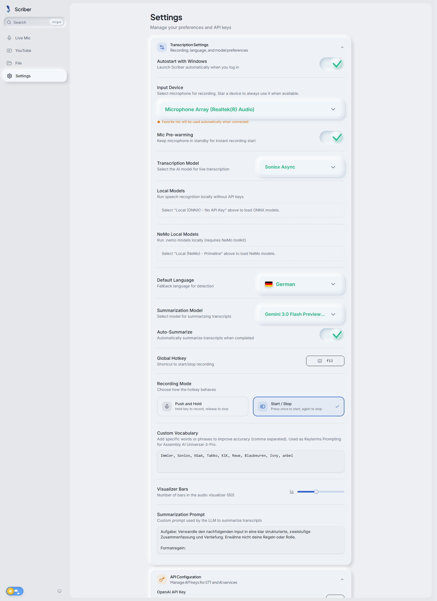

<p align="center">
  
</p>

<h1 align="center">Scriber</h1>

<p align="center">
  <strong>AI-Powered Voice Transcription for Windows</strong><br>
  <em>Live dictation, YouTube transcription, and file processing with LLM-powered summaries</em>
</p>

<p align="center">
  <a href="#-features">Features</a> •
  <a href="#-screenshots">Screenshots</a> •
  <a href="#-quick-start">Quick Start</a> •
  <a href="#-usage">Usage</a> •
  <a href="#-configuration">Configuration</a>
</p>

---

## ✨ Features

### 🎤 Live Dictation
Press a global hotkey (`Ctrl+Alt+S` by default) from anywhere on your system to instantly start recording. A sleek overlay appears with real-time audio visualization and transcription. Perfect for taking quick notes, writing emails, or dictating documents.

### 📺 YouTube Transcription
Paste any YouTube URL or search for videos directly within the app. Scriber downloads the audio and transcribes it with speaker diarization, making it ideal for podcasts, interviews, lectures, and video research.

### 📁 File Upload
Drag & drop audio or video files up to **2GB**. Scriber automatically extracts audio from video formats (MP4, MOV, MKV, etc.) and transcribes them. Supports MP3, WAV, FLAC, M4A, and many more formats.

### 🤖 AI Summarization
Generate intelligent summaries of your transcripts using **Google Gemini** or **OpenAI GPT** models. Customize the summarization prompt to get exactly the output format you need—bullet points, action items, or full prose.

### 👥 Speaker Diarization
Automatically identify and label different speakers in your transcripts with color-coded badges. Essential for meetings, interviews, and multi-person recordings.

### 📤 Export Options
Export your transcripts and summaries to **PDF** or **DOCX** with proper formatting. Markdown in summaries is rendered correctly, and speaker labels are preserved.

### 🔍 Search & Filter
Quickly find any transcript with instant search across all your recordings. Each category (Live Mic, YouTube, Files) maintains its own searchable history.

### 🔔 System Tray Integration
Scriber runs silently in your system tray. Access recent recordings, view logs, or control the app with a right-click—no windows cluttering your desktop.

---

## 📸 Screenshots

### Live Mic Recording
<p align="center">
  
</p>
<p align="center"><em>Instant voice-to-text with real-time audio visualization and recording history</em></p>

### YouTube Transcription
<p align="center">
  
</p>
<p align="center"><em>Search YouTube or paste URLs to transcribe any video with speaker identification</em></p>

### File Upload
<p align="center">
  
</p>
<p align="center"><em>Drag & drop audio/video files for automatic transcription</em></p>

### Transcript Detail
<p align="center">
  
</p>
<p align="center"><em>Full transcript view with AI summary, speaker labels, and export options</em></p>

### Settings
<p align="center">
  
</p>
<p align="center"><em>Configure transcription models, hotkeys, and API integrations</em></p>

---

## 🚀 Quick Start

### Windows

1. **Clone the repository**
   ```bash
   git clone https://github.com/MyButtermilk/Scriber.git
   cd Scriber
   ```

2. **Run the launcher**
   ```bash
   start.bat
   ```
   
   This will automatically:
   - Create a Python virtual environment
   - Install all backend dependencies
   - Install frontend dependencies (npm)
   - Launch the application

3. **Access the Web UI**
   
   The app opens automatically at `http://localhost:5000`. A tray icon appears for background control.

### Requirements
- **Python 3.10+**
- **Node.js 18+**
- **FFmpeg** (for video file processing)

---

## 📖 Usage

### Global Hotkey
Press `Ctrl+Alt+S` (configurable) from anywhere to toggle recording. The live overlay shows:
- Real-time audio levels
- Interim transcription text
- Recording duration

### Web Interface

| Tab | Purpose |
|-----|---------|
| **Live Mic** | View real-time transcription and recording history |
| **YouTube** | Paste URLs or search to transcribe videos |
| **Files** | Upload audio/video files for processing |
| **Settings** | Configure models, hotkeys, and API keys |

### System Tray
Right-click the tray icon to:
- **Recent Recordings**: Click to copy transcript to clipboard
- **View Logs**: Debug issues with backend/frontend
- **Open Web UI**: Launch the browser interface
- **Restart / Quit**: Control the application

---

## ⚙️ Configuration

Scriber uses environment variables and a `.env` file for configuration. Key settings:

### Speech-to-Text Providers

| Provider | Env Variable | Features |
|----------|--------------|----------|
| **Soniox** | `SONIOX_API_KEY` | Real-time streaming, speaker diarization |
| **Deepgram** | `DEEPGRAM_API_KEY` | Nova-2 model, fast processing |
| **OpenAI** | `OPENAI_API_KEY` | Whisper model |
| **AssemblyAI** | `ASSEMBLYAI_API_KEY` | Universal model |
| **Azure** | `AZURE_SPEECH_KEY` | Microsoft Speech Services |
| **Gladia** | `GLADIA_API_KEY` | Multi-language support |
| **Speechmatics** | `SPEECHMATICS_API_KEY` | Enterprise-grade accuracy |
| **AWS** | `AWS_ACCESS_KEY_ID` | Transcribe service |

### AI Summarization

| Provider | Env Variable |
|----------|--------------|
| **Google Gemini** | `GOOGLE_API_KEY` |
| **OpenAI** | `OPENAI_API_KEY` |

### App Settings

```env
# Recording
SCRIBER_HOTKEY=ctrl+alt+s
SCRIBER_DEFAULT_STT=soniox
SCRIBER_MIC_DEVICE=default

# Summarization
SCRIBER_AUTO_SUMMARIZE=0
SCRIBER_SUMMARIZATION_MODEL=gemini-2.0-flash

# YouTube
YOUTUBE_API_KEY=your_key_here
```

---

## 🏗️ Architecture

```
┌─────────────────┐     ┌─────────────────┐     ┌─────────────────┐
│   System Tray   │────▶│  Python Backend │◀────│  React Frontend │
│   (tray.py)     │     │  (web_api.py)   │     │  (Vite + React) │
└─────────────────┘     └─────────────────┘     └─────────────────┘
        │                       │                       │
        │                       ▼                       │
        │               ┌─────────────────┐             │
        │               │  SQLite DB      │             │
        │               │  (transcripts)  │             │
        │               └─────────────────┘             │
        │                       │                       │
        ▼                       ▼                       ▼
   Global Hotkeys      STT Pipeline             WebSocket
   Overlay Window      (Multiple Providers)    (Real-time Updates)
```

**Key Components:**
- **`src/tray.py`**: Entry point, manages process lifecycle
- **`src/web_api.py`**: aiohttp server with REST API + WebSocket
- **`src/pipeline.py`**: STT provider abstraction
- **`src/export.py`**: PDF/DOCX generation
- **`Frontend/`**: React 19 + Vite + Tailwind CSS

---

## 📦 Project Structure

```
Scriber/
├── src/
│   ├── tray.py           # System tray & process manager
│   ├── web_api.py        # Backend API server
│   ├── pipeline.py       # STT provider orchestration
│   ├── database.py       # SQLite persistence
│   ├── export.py         # PDF/DOCX export
│   ├── overlay.py        # Recording overlay window
│   └── config.py         # Configuration loader
├── Frontend/
│   └── client/
│       └── src/
│           ├── pages/    # React page components
│           ├── components/ # Reusable UI components
│           └── hooks/    # Custom React hooks
├── docs/
│   └── screenshots/      # App screenshots
├── start.bat             # Windows launcher
├── requirements.txt      # Python dependencies
└── transcripts.db        # Local database (auto-created)
```

---

## 🔧 Troubleshooting

| Issue | Solution |
|-------|----------|
| **App doesn't start** | Run `python -m src.tray` manually to see errors |
| **No audio input** | Check microphone selection in Settings |
| **STT fails** | Verify API key in Settings → API Configuration |
| **Export fails** | Install: `pip install python-docx reportlab lxml` |
| **YouTube fails** | Ensure YouTube API key is set in Settings |

---

## 📄 License

MIT License - see [LICENSE](LICENSE) for details.

---

<p align="center">
  Made with ❤️ for efficient voice-to-text workflows
</p>
