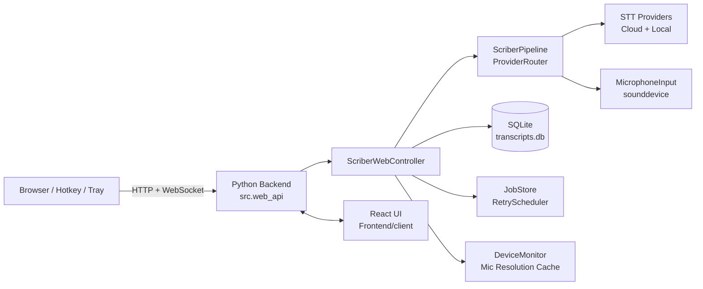

# Scriber

<p align="center">
  
</p>

<h1 align="center">Scriber</h1>

<p align="center">
  <strong>AI-powered speech-to-text workflows for desktop and web.</strong><br>
  <em>Live dictation, YouTube transcription, file transcription, transcript management, summaries, and export.</em>
</p>

<p align="center">
  <a href="#status">Status</a> •
  <a href="#features">Features</a> •
  <a href="#quick-start">Quick Start</a> •
  <a href="#usage">Usage</a> •
  <a href="#architecture">Architecture</a> •
  <a href="#api">API</a> •
  <a href="#configuration">Configuration</a> •
  <a href="#development">Development</a> •
  <a href="#troubleshooting">Troubleshooting</a>
</p>

---

## Status

Last verified: 2026-06-01

Scriber is a local-first transcription app with a Python backend, a React web UI, a new experimental Tauri desktop shell, and a legacy Tkinter fallback UI. The current primary runtime is Windows with tray integration, global hotkeys, microphone device monitoring, and local SQLite persistence.

Current implementation highlights:

- Live microphone transcription with WebSocket status/audio/transcript events.
- YouTube and file transcription with persistent jobs, retry scheduling, and resume support.
- Multi-provider STT support, including cloud providers and local ONNX/NeMo paths.
- SQLite transcript storage with WAL mode, metadata list loading, pagination, and FTS5 search.
- DeviceMonitor for microphone hotplug handling with native Windows endpoint events where available and polling fallback.
- Recording-aware PortAudio refresh: device refreshes are deferred while a recording stream is active and run once after the stream becomes idle.
- Short-lived microphone device-resolution cache for selected/favorite mic lookup.
- Route-level frontend lazy loading for non-default pages, manual vendor chunks, and a single shared WebSocket connection.
- Tauri 2 desktop scaffold with a Rust supervisor that starts the Python backend, negotiates a runtime backend URL, checks the Scriber health contract, and avoids a visible Python console window on Windows.
- Backend hot-path reductions: no-client WebSocket broadcasts skip JSON serialization, audio-level callbacks avoid UI broadcast work without clients/overlay, long transcript appends buffer final segments, and upload/export cleanup paths are offloaded from the event loop where practical.
- Runtime data path support via `SCRIBER_DATA_DIR`: the Tauri-supervised backend writes settings, SQLite data, downloads, and logs to a writable app data directory instead of relying on the repository or install directory.
- Backend sidecar path for Tauri: the supervisor can start a packaged `scriber-backend` worker and falls back to the source checkout/virtualenv for development.

Known limits:

- `SCRIBER_MIC_ALWAYS_ON` exists as a setting, but it is not a true app-level always-on/prewarmed microphone stream yet. Per-session streams are closed during cleanup to avoid orphaned PortAudio resources.
- Frontend transcript-list virtualization/infinite loading is still open.
- The Tauri shell can supervise a packaged backend worker, but the full signed installer/updater pipeline is still a separate packaging phase.
- Some CPU-heavy media preprocessing still depends on ffmpeg/provider behavior even though disk writes, cleanup, and export rendering are offloaded.

---

## Features

### Live Microphone Dictation

- Global hotkey, default `Ctrl+Alt+S`.
- Modes:
  - `toggle`: press once to start, press again to stop.
  - `push_to_talk`: record while the hotkey is held.
- Live WebSocket events for state, status, audio level, warnings, transcripts, session lifecycle, history updates, and errors.
- Favorite microphone selection with fallback to selected/default device.
- Device hotplug detection via `DeviceMonitor`.
- Low input-level warning flow for muted/quiet microphones.
- Recording overlay with preparing/recording/transcribing states.
- Text injection into the active app through `auto`, `sendinput`, `paste`, or `type`.

### YouTube Transcription

- YouTube search and video lookup through the YouTube Data API.
- Download and audio extraction through `yt-dlp` and ffmpeg.
- Persistent job lifecycle with retry/resume support.
- Transcript entries are saved as `youtube` records.

### File Transcription

- Multipart upload through `POST /api/file/transcribe`.
- Supported audio formats: `.mp3`, `.wav`, `.m4a`, `.flac`, `.aac`, `.ogg`.
- Supported video formats: `.mp4`, `.mov`, `.webm`, `.avi`, `.mkv`, `.m4v`.
- Video audio extraction through ffmpeg.
- Default audio upload limit: `200 MB`.
- Raw video upload hard limit: `2048 MB`.
- Extracted/compressed audio is limited by the final audio/provider limit.

### STT Providers

Provider coverage includes:

- Soniox realtime and async
- Mistral realtime and async
- AssemblyAI Universal-3-Pro async
- Deepgram
- OpenAI
- Azure Speech
- Azure MAI Transcribe
- Gladia
- Groq
- Speechmatics
- ElevenLabs
- Google
- AWS Transcribe
- Smallest
- ONNX local models
- NeMo local models

Provider routing, retry scheduling, and circuit-breaker logic exist in the backend. Verify provider-specific behavior in code before changing a provider contract.

### Transcript Management

- SQLite persistence in `transcripts.db`.
- Transcript list pagination with `offset`/`limit`.
- Type filtering by `mic`, `youtube`, or `file`.
- FTS5-backed search.
- Detail view with full content and summary.
- Delete, cancel, summarize, export.
- Export as PDF or DOCX.
- Optional automatic summarization after job completion.

### Local Models

- ONNX model list, download, status, delete.
- Quantization options: `int8`, `fp16`, `fp32`.
- Optional ONNX GPU flag.
- NeMo model list, download, delete.

---

## Screenshots

### Live Mic

<p align="center">
  
</p>

### YouTube

<p align="center">
  
</p>

### File Upload

<p align="center">
  
</p>

### Transcript Detail

<p align="center">
  
</p>

### Settings

<p align="center">
  
</p>

---

## Quick Start

### Prerequisites

- Python 3.10+
- Node.js 20+ for the web UI
- ffmpeg available on `PATH`, configured through `SCRIBER_FFMPEG_PATH`, or bundled with the desktop sidecar for YouTube/file audio extraction
- Windows recommended for tray, global hotkey, overlay, and microphone device monitoring

### Windows

```bash
git clone https://github.com/MyButtermilk/Scriber.git
cd Scriber
start.bat
```

`start.bat` handles:

- Python check
- virtual environment setup
- dependency installation when needed
- initial `.env` creation if missing
- tray/web startup when Node and `Frontend/` are available
- Tkinter fallback when the web UI cannot be started
- backend health check at `http://127.0.0.1:8765/api/health`
- browser open at `http://localhost:5000`

### Linux/macOS

```bash
./start.sh
```

The shell script sets up dependencies and starts the Tkinter path. The full tray/hotkey/device-monitor experience is Windows-focused.

### Manual Backend and Frontend

```bash
# Backend only
python -m src.web_api
```

```bash
# Frontend client only
cd Frontend
npm install
npm run dev:client
```

```bash
# Frontend Express/Vite dev host
cd Frontend
npm run dev
```

```bash
# Frontend production build and start
cd Frontend
npm run build
npm start
```

Default URLs:

- Backend: `http://127.0.0.1:8765`
- Web UI: `http://localhost:5000`
- WebSocket: `ws://127.0.0.1:8765/ws`

Additional entrypoints:

```bash
python -m src.tray
python -m src.main
```

---

## Usage

### Web Routes

- `/`: Live Mic
- `/youtube`: YouTube transcription
- `/file`: File transcription
- `/transcript/:id`: Transcript detail
- `/settings`: Settings

### Live Mic

1. Select the STT provider and microphone in Settings.
2. Optional: set a favorite microphone. It is preferred when available.
3. Start from the UI or with the configured hotkey.
4. Wait for the overlay/state to switch from preparing to recording before speaking.
5. Stop recording through UI or hotkey.
6. The final transcript is saved as a `mic` entry and can be summarized/exported.

Important microphone behavior:

- DeviceMonitor keeps the frontend microphone list updated after USB/dock changes.
- PortAudio refresh is deferred during active recording to avoid native races.
- Mic selection is cached briefly to avoid repeated device scans on consecutive starts.
- `SCRIBER_MIC_ALWAYS_ON=1` does not yet keep a reusable app-level mic stream alive.

### YouTube

1. Set `YOUTUBE_API_KEY`.
2. Search or paste a video URL/ID.
3. Start transcription.
4. Track job progress in the UI and transcript history.

### File Upload

1. Open `/file`.
2. Drop or select an audio/video file.
3. The backend validates size/type, extracts audio for videos, and starts a transcription job.
4. Results appear in transcript history.

### Settings

The backend settings API manages:

- hotkey and recording mode
- STT provider and provider-specific models
- language
- microphone and favorite microphone
- injection method
- API keys
- ONNX/NeMo local models
- summarization model, prompt, and auto-summary setting
- visualizer bar count

AWS credentials are not fully managed through `apiKeys`; use the standard AWS environment variables.

---

## Architecture


```mermaid
flowchart LR
    User["Browser / Hotkey / Tray"] -->|"HTTP + WebSocket"| Backend["Python Backend\nsrc.web_api"]
    Backend --> Controller["ScriberWebController"]
    Controller --> Pipeline["ScriberPipeline\nProviderRouter"]
    Controller --> DB[("SQLite\ntranscripts.db")]
    Controller --> Jobs["JobStore\nRetryScheduler"]
    Controller --> Monitor["DeviceMonitor\nMic Resolution Cache"]
    Pipeline --> Providers["STT Providers\nCloud + Local"]
    Pipeline --> Mic["MicrophoneInput\nsounddevice"]
    Backend <--> Frontend["React UI\nFrontend/client"]
```

### Runtime Paths

- Live Mic:
  - `POST /api/live-mic/start|stop|toggle`
  - microphone stream
  - Pipecat/STT pipeline
  - WebSocket events
  - transcript persistence
  - optional text injection
- YouTube:
  - YouTube Data API lookup
  - `yt-dlp` download
  - ffmpeg audio extraction
  - STT pipeline/direct provider path
  - job persistence and retry/resume
- File:
  - multipart upload
  - size/type validation
  - optional ffmpeg extraction/compression
  - STT pipeline/direct provider path
  - transcript persistence
- Frontend:
  - REST for commands and data
  - single shared WebSocket for live events
  - React Query for server state

### Backend Modules

- `src/web_api.py`: REST, WebSocket, settings, jobs, transcript API.
- `src/pipeline.py`: provider creation, STT pipeline, analyzer cache, mic resolution.
- `src/microphone.py`: `sounddevice` transport and audio callback.
- `src/audio_devices.py`: deduplication, host API priority, compatibility.
- `src/device_monitor.py`: hotplug detection and PortAudio refresh.
- `src/database.py`: SQLite persistence and FTS.
- `src/runtime/`: provider router and retry scheduler.
- `src/core/`: state machine, circuit breaker, error taxonomy, event contracts, tracing.

### Frontend Architecture

- Vite 7 + React 19 + TypeScript.
- Wouter routing.
- TanStack Query for API data.
- Single `WebSocketProvider`.
- LiveMic is eagerly loaded for the default route.
- YouTube, File, Settings, TranscriptDetail, and NotFound are lazy-loaded chunks.
- Tailwind v4 CSS-first setup through `Frontend/client/src/index.css`.
- Radix/shadcn-style primitives and existing neumorphic classes.

---

## API

### System

- `GET /api/health`
- `GET /api/state`
- `GET /api/metrics/hot-path?limit=n`

`limit` for hot-path metrics is clamped to `1..500`.

### WebSocket

- `GET /ws`

Core event types:

- `state`
- `status`
- `transcript`
- `audio_level`
- `input_warning`
- `transcribing`
- `session_started`
- `session_finished`
- `history_updated`
- `error`

### Live Mic

- `POST /api/live-mic/start`
- `POST /api/live-mic/stop`
- `POST /api/live-mic/toggle`

### Transcripts

- `GET /api/transcripts?offset=0&limit=50&type={mic|youtube|file}&q={query}`
- `GET /api/transcripts/{id}`
- `DELETE /api/transcripts/{id}`
- `POST /api/transcripts/{id}/summarize`
- `POST /api/transcripts/{id}/cancel`
- `GET /api/transcripts/{id}/export/{format}`

`limit` defaults to `50` and is clamped to `1..100`. Export format is `pdf` or `docx`.

### YouTube

- `GET /api/youtube/search?q={query}&maxResults={n}&pageToken={token}`
- `GET /api/youtube/video?id={id}`
- `GET /api/youtube/video?url={url}`
- `POST /api/youtube/transcribe`

### File

- `POST /api/file/transcribe`

Expected body: `multipart/form-data` with field `file`.

### Settings, Devices, Autostart

- `GET /api/settings`
- `PUT /api/settings`
- `GET /api/microphones`
- `GET /api/autostart`
- `POST /api/autostart`

### Local Models

- `GET /api/onnx/models`
- `GET /api/onnx/models/{model_id}`
- `POST /api/onnx/download`
- `DELETE /api/onnx/models/{model_id}`
- `GET /api/nemo/models`
- `POST /api/nemo/download`
- `DELETE /api/nemo/models/{model_id}`

ONNX model status/delete can use an optional `quantization` query parameter.

---

## Configuration

Configuration is loaded from environment variables and `.env`. Multi-line summarization prompt state can also be stored in `settings.json`.

Do not commit `.env`, `settings.json`, `transcripts.db`, `downloads/`, or generated local artifacts.

### Web/API

```env
SCRIBER_WEB_HOST=127.0.0.1
SCRIBER_WEB_PORT=8765
SCRIBER_ALLOWED_ORIGINS=
```

Default CORS allows localhost, `127.0.0.1`, and `::1`. `SCRIBER_ALLOWED_ORIGINS=*` allows all origins.

### Runtime Storage

```env
SCRIBER_DATA_DIR=
SCRIBER_DATABASE_PATH=
SCRIBER_DOWNLOADS_DIR=downloads
```

In a normal source checkout, state defaults to the repository root for backwards compatibility. When `SCRIBER_DATA_DIR` is set, `settings.json`, `transcripts.db`, and relative download directories are resolved under that directory. The Tauri supervisor sets this automatically to a writable Scriber app-data directory for the managed backend.

### Desktop Backend Worker

```env
SCRIBER_BACKEND_EXE=
SCRIBER_BACKEND_DIR=
SCRIBER_BACKEND_LAUNCH_KIND=
SCRIBER_FORCE_MANAGED_BACKEND=0
SCRIBER_MEDIA_TOOLS_DIR=
SCRIBER_FFMPEG_PATH=
SCRIBER_FFPROBE_PATH=
SCRIBER_YT_DLP_PATH=
```

The Tauri supervisor prefers a packaged backend sidecar when `SCRIBER_BACKEND_EXE` points to one, or when a `scriber-backend` executable is found next to the Tauri app under `backend\` or `binaries\`. If no sidecar exists, development mode falls back to `python -m src.web_api` through `SCRIBER_PYTHON` or the local virtualenv.

Media tools are resolved in this order: explicit tool env var, `SCRIBER_MEDIA_TOOLS_DIR`, bundled folders under the backend app root such as `tools\ffmpeg\`, then system `PATH`. The PyInstaller sidecar bundles the `yt-dlp` Python package; `-BundleMediaTools` copies local `ffmpeg`/`ffprobe` binaries into the sidecar output when they are available.

### Frontend

```env
VITE_BACKEND_URL=http://127.0.0.1:8765
PORT=5000
```

### Recording and Provider Selection

```env
SCRIBER_HOTKEY=ctrl+alt+s
SCRIBER_MODE=toggle
SCRIBER_DEFAULT_STT=soniox
SCRIBER_STT_FALLBACKS=
SCRIBER_LANGUAGE=auto
SCRIBER_DEBUG=0
SCRIBER_CUSTOM_VOCAB=
```

### Provider Models

```env
SCRIBER_SONIOX_MODE=realtime
SCRIBER_SONIOX_ASYNC_MODEL=stt-async-v4
SCRIBER_SONIOX_RT_MODEL=stt-rt-v4
SCRIBER_MISTRAL_RT_MODEL=voxtral-mini-transcribe-realtime-2602
SCRIBER_MISTRAL_ASYNC_MODEL=voxtral-mini-2602
SCRIBER_OPENAI_STT_MODEL=gpt-4o-mini-transcribe-2025-12-15
SCRIBER_AZURE_MAI_REGION=northeurope
```

### Microphone and Injection

```env
SCRIBER_MIC_DEVICE=default
SCRIBER_FAVORITE_MIC=
SCRIBER_MIC_ALWAYS_ON=0
SCRIBER_MIC_BLOCK_SIZE=512
SCRIBER_MIC_DEVICE_CACHE_TTL_SEC=10.0
SCRIBER_MIC_LOW_RMS_THRESHOLD=0.001
SCRIBER_MIC_LOW_RMS_CLEAR_THRESHOLD=0.0025
SCRIBER_MIC_LOW_RMS_WARN_AFTER_SECS=6.0
SCRIBER_INJECT_METHOD=auto
SCRIBER_PASTE_PRE_DELAY_MS=80
SCRIBER_PASTE_RESTORE_DELAY_MS=1500
```

`SCRIBER_MIC_ALWAYS_ON` is currently not a real persistent prewarm stream. Leave it off unless you are testing the surrounding setting flow.

### Uploads, Jobs, Timeouts

```env
SCRIBER_UPLOAD_MAX_MB=200
SCRIBER_UPLOAD_MAX_BYTES=
SCRIBER_JOB_MAX_ATTEMPTS=3
SCRIBER_JOB_RETRY_BASE_SEC=5
SCRIBER_JOB_RETRY_MAX_SEC=120
SCRIBER_TIMEOUT_FILE_TRANSCRIBE_SEC=600
SCRIBER_TIMEOUT_YOUTUBE_TRANSCRIBE_SEC=600
SCRIBER_TIMEOUT_YOUTUBE_DOWNLOAD_SEC=300
```

### Circuit Breaker and Diagnostics

```env
SCRIBER_BREAKER_FAILURE_THRESHOLD=3
SCRIBER_BREAKER_COOLDOWN_SEC=30
SCRIBER_VALIDATE_WS_CONTRACTS=0
SCRIBER_HOTKEY_DISPATCH_DEBOUNCE_SEC=0.25
SCRIBER_LOG_STDERR=1
```

### Summarization

```env
SCRIBER_SUMMARIZATION_MODEL=gemini-flash-latest
SCRIBER_AUTO_SUMMARIZE=0
SCRIBER_SUMMARY_MIN_WORDS=180
SCRIBER_SUMMARY_MAX_WORDS=2200
SCRIBER_SUMMARIZATION_PROMPT=...
```

Current default summarization model: `gemini-flash-latest`.

### API Keys

```env
SONIOX_API_KEY=...
MISTRAL_API_KEY=...
ASSEMBLYAI_API_KEY=...
DEEPGRAM_API_KEY=...
OPENAI_API_KEY=...
AZURE_SPEECH_KEY=...
AZURE_SPEECH_REGION=...
GLADIA_API_KEY=...
GROQ_API_KEY=...
SPEECHMATICS_API_KEY=...
ELEVENLABS_API_KEY=...
GOOGLE_API_KEY=...
GOOGLE_APPLICATION_CREDENTIALS=/path/to/credentials.json
YOUTUBE_API_KEY=...
```

AWS uses standard SDK environment variables:

```env
AWS_ACCESS_KEY_ID=...
AWS_SECRET_ACCESS_KEY=...
AWS_REGION=...
```

### Local Models and UI

```env
SCRIBER_ONNX_MODEL=nemo-parakeet-tdt-0.6b-v3
SCRIBER_ONNX_QUANTIZATION=int8
SCRIBER_ONNX_USE_GPU=0
SCRIBER_NEMO_MODEL=parakeet-primeline
SCRIBER_VISUALIZER_BAR_COUNT=60
```

---

## Development

### Backend Commands

```bash
python -m venv venv
venv\Scripts\activate
pip install -r requirements.txt
python check_imports.py
python -m src.web_api
```

### Frontend Commands

```bash
cd Frontend
npm install
npm run dev:client
npm run check
npm run build
npm start
```

Do not run `npm run dev:client` and `npm run dev` at the same time on the default port.

### Tauri Desktop Commands

```bash
cd Frontend
npm run tauri:dev
npm run tauri:build
```

The current Tauri shell is a hybrid runtime: Rust owns the desktop window and supervises the Python backend. It prefers a packaged backend sidecar (`SCRIBER_BACKEND_EXE` or `backend\scriber-backend.exe` next to the Tauri executable) and falls back in development to `SCRIBER_PYTHON`, `venv\Scripts\python.exe`, `.venv\Scripts\python.exe`, or `python` running `python -m src.web_api`. The backend reports `/api/health` and `/api/runtime` metadata including API version, runtime mode, launch kind, PID, host, port, start time, capabilities, and startup flags.

Build the backend sidecar with PyInstaller:

```powershell
python scripts\sync_version.py
powershell -ExecutionPolicy Bypass -File scripts\build_tauri_backend_sidecar.ps1 -InstallPyInstaller -CopyToTauriRelease
powershell -ExecutionPolicy Bypass -File scripts\build_tauri_backend_sidecar.ps1 -BundleMediaTools -CopyToTauriRelease
powershell -ExecutionPolicy Bypass -File scripts\build_windows.ps1
```

This builds `src/backend_worker.py` through `packaging\scriber-backend.spec` into `dist\tauri-sidecar\scriber-backend\` and optionally copies the onedir output to `Frontend\src-tauri\target\release\backend\`, where the Tauri supervisor can find it automatically. Use `-BundleMediaTools` to copy local `ffmpeg`/`ffprobe` binaries into `tools\ffmpeg\` inside the sidecar.

Application version lives in `src/version.py`. `scripts\sync_version.py` copies it into the Tauri, Cargo, npm, and lockfile manifests. `scripts\build_windows.ps1` runs the sync before checks/builds, invokes `npm run tauri:build -- --bundles nsis`, lets Tauri build/copy the backend sidecar before bundling, and produces the NSIS installer under `Frontend\src-tauri\target\release\bundle\nsis\`.

The current sidecar spec is a standard cloud-provider build and intentionally excludes heavy local ASR stacks such as NeMo/ONNX-ASR/Torch. Local ASR packaging remains a separate optional package path.

After building the Windows release executable, run the desktop smoke test from the repository root:

```powershell
powershell -ExecutionPolicy Bypass -File scripts\smoke_tauri_desktop.ps1
```

The smoke test starts `Frontend\src-tauri\target\release\scriber-desktop.exe`, verifies that Tauri starts a managed backend with `runtimeMode=tauri-supervised`, then hard-stops the app and checks that no newly spawned backend process remains. Pass `-BackendExePath path\to\scriber-backend.exe` to force a specific sidecar.

### Tests

```bash
pytest
pytest tests/test_device_monitor.py
pytest tests/test_microphone_device_resolution.py tests/test_microphone_callback.py
pytest tests/test_web_api_security.py::test_origin_allowed_defaults
pytest -k origin_allowed
```

Current test layout includes backend, runtime, core, data, contract, and perf tests under `tests/`.

Useful focused tests:

- Device monitor and mic selection:
  - `pytest tests/test_device_monitor.py tests/test_microphone_device_resolution.py`
- Microphone callback/channel handling:
  - `pytest tests/test_microphone_channel_selection.py tests/test_microphone_callback.py`
- Pipeline lifecycle:
  - `pytest tests/test_pipeline_stop.py tests/test_web_api_lifecycle.py`
- WebSocket contracts:
  - `pytest tests/contract/test_ws_events.py`
- Provider routing/circuit breaker:
  - `pytest tests/runtime/test_provider_router.py tests/core/test_provider_circuit_breaker.py`

### Quality Checks

```bash
python -m py_compile src\microphone.py src\pipeline.py src\web_api.py
git diff --check
```

```powershell
powershell -ExecutionPolicy Bypass -File scripts\smoke_tauri_desktop.ps1
```

```bash
cd Frontend
npm run check
npm run build
```

---

## Project Structure

```text
Scriber/
├── src/
│   ├── web_api.py                  # aiohttp REST + WebSocket API
│   ├── pipeline.py                 # STT pipeline and provider factory
│   ├── microphone.py               # sounddevice input transport
│   ├── audio_devices.py            # mic normalization/dedup/compatibility
│   ├── device_monitor.py           # hotplug detection and PortAudio refresh
│   ├── audio_file_input.py         # ffmpeg file input transport
│   ├── config.py                   # env + settings.json configuration
│   ├── database.py                 # SQLite persistence and FTS
│   ├── injector.py                 # text injection
│   ├── summarization.py            # Gemini/OpenAI summaries
│   ├── youtube_api.py              # YouTube Data API
│   ├── youtube_download.py         # yt-dlp + ffmpeg extraction
│   ├── export.py                   # PDF/DOCX export
│   ├── overlay.py                  # recording overlay
│   ├── tray.py                     # tray lifecycle
│   ├── main.py                     # Tkinter fallback
│   ├── core/                       # state, contracts, tracing, breakers
│   ├── data/                       # job and metrics stores
│   └── runtime/                    # provider routing and retry scheduling
├── Frontend/
│   ├── client/                     # React app
│   ├── server/                     # Express/Vite host
│   ├── shared/                     # shared TS schema/types
│   └── src-tauri/                  # Tauri 2 desktop shell and Rust supervisor
├── tests/                          # pytest suite
├── docs/                           # architecture and status docs
├── start.bat
├── start.sh
├── requirements.txt
└── README.md
```

---

## Troubleshooting

### Backend does not start

Run:

```bash
python -m src.web_api
```

Then check `latest.log` / structured logs if present. Also run:

```bash
python check_imports.py
```

### Web UI does not load

Check:

- backend health: `http://127.0.0.1:8765/api/health`
- frontend port: `http://localhost:5000`
- `VITE_BACKEND_URL` if backend host/port is customized
- CORS via `SCRIBER_ALLOWED_ORIGINS`

### No microphone appears

Check:

- `GET /api/microphones`
- Windows microphone privacy settings
- selected/favorite mic in Settings
- dock/USB reconnect

The DeviceMonitor should pick up hotplug changes. During active recording, PortAudio refresh is intentionally deferred until after stop.

### Favorite microphone is not used

- Confirm the device label in `GET /api/microphones`.
- Clear or update `SCRIBER_FAVORITE_MIC`.
- Device resolution is cached briefly; changing mic settings or hotplug events invalidate the cache.

### First words are cut off

- Wait until the overlay/state switches from preparing to recording.
- `SCRIBER_MIC_ALWAYS_ON` is not true app-level prewarming yet.
- Check `docs/Mic-Performance-Enhancement.md` for current mic latency status.

### YouTube transcription fails

- Set `YOUTUBE_API_KEY`.
- Verify `yt-dlp` and ffmpeg availability. In packaged Tauri builds, check `tools\ffmpeg\` inside the backend sidecar or set `SCRIBER_FFMPEG_PATH`.
- Check timeout settings and provider API keys.

### File upload fails

- Verify extension and size limits.
- For video, ensure ffmpeg can extract audio from `PATH`, `SCRIBER_FFMPEG_PATH`, or the bundled sidecar tools directory.
- Check provider-specific upload limits in backend logs/settings.

### Local models are missing

- Check ONNX/NeMo dependencies.
- Use the Settings UI or `/api/onnx/models` and `/api/nemo/models`.
- Ensure model directories are writable.

---

## Roadmap / Open Engineering Work

- Real app-level microphone prewarming for `SCRIBER_MIC_ALWAYS_ON`.
- Frontend transcript-list virtualization or infinite query.
- Full bundled desktop packaging: signing and updater.
- Broader runtime smoke tests for the Tauri supervisor: backend crash, startup timeout, external backend attach, dynamic port, and app-exit cleanup.
- More hardware regression tests for dock/USB mic add/remove and favorite fallback.
- Stronger typed API contract between backend and frontend.
- Smaller backend modules by splitting `src/web_api.py` into domains.

---

## License

Scriber is distributed under the MIT license. See `LICENSE`.

---

<p align="center">Efficient, resumable, multi-provider speech-to-text workflows.</p>
