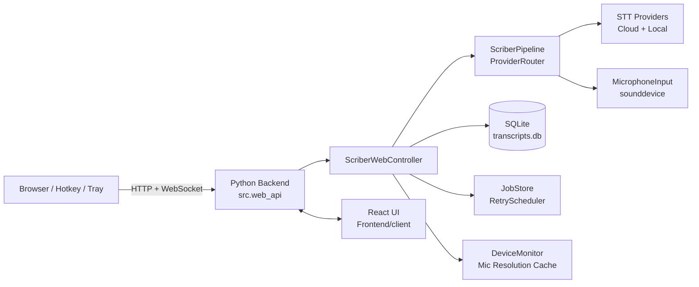

# Scriber

<p align="center">
  
</p>

<h1 align="center">Scriber</h1>

<p align="center">
  <strong>AI-powered speech-to-text workflows for desktop and web.</strong><br>
  <em>Live dictation, YouTube transcription, file transcription, transcript management, summaries, and export.</em>
</p>

<p align="center">
  <a href="#status">Status</a> •
  <a href="#features">Features</a> •
  <a href="#quick-start">Quick Start</a> •
  <a href="#usage">Usage</a> •
  <a href="#architecture">Architecture</a> •
  <a href="#api">API</a> •
  <a href="#configuration">Configuration</a> •
  <a href="#development">Development</a> •
  <a href="#troubleshooting">Troubleshooting</a>
</p>

---

## Status

Last verified: 2026-06-02

Scriber is a local-first transcription app with a Python backend, a React web UI, a Tauri desktop shell, and legacy Tkinter/Python tray fallback paths. Tauri is the primary desktop runtime; the legacy desktop paths are maintenance-only fallback per `docs/Legacy-Desktop-Fallback-Decision.md`. The current primary platform is Windows with tray integration, global hotkeys, microphone device monitoring, and local SQLite persistence.

Current implementation highlights:

- Live microphone transcription with WebSocket status/audio/transcript events.
- YouTube and file transcription with persistent jobs, retry scheduling, and resume support.
- Multi-provider STT support, including cloud providers and local ONNX/NeMo paths.
- SQLite transcript storage with WAL mode, metadata list loading, pagination, and FTS5 search.
- DeviceMonitor for microphone hotplug handling with native Windows endpoint events where available and polling fallback.
- Recording-aware PortAudio refresh: device refreshes are deferred while a recording stream is active and run once after the stream becomes idle.
- Short-lived microphone device-resolution cache for selected/favorite mic lookup.
- Route-level frontend lazy loading for non-default pages, manual vendor chunks, and a single shared WebSocket connection.
- Tauri 2 desktop scaffold with a Rust supervisor that starts the Python backend, negotiates a runtime backend URL, checks the Scriber health contract, enforces one Windows desktop instance through a named mutex, owns the native app menu, tray lifecycle commands, Windows desktop autostart, and global hotkey dispatch, and avoids a visible Python console window on Windows.
- In-app Debug Console route for packaged diagnostics with redacted backend/Tauri log tailing, text/source/level filters, color-coded severity rows, copy-visible-log support, auto-refresh/auto-scroll controls, and support-bundle download.
- Minimal Tauri desktop permissions: the webview only gets app version lookup, process relaunch, and the update check/install commands; backend process execution stays inside the Rust supervisor and is restricted to the Scriber backend sidecar names.
- Tauri-supervised backend access is protected by a per-run session token: Rust passes `SCRIBER_SESSION_TOKEN` to the worker, React reads it through `get_backend_access`, and backend REST/WebSocket URLs carry a `scriberToken` query parameter.
- Installed Tauri frontend startup is guarded by a token-protected WebView readiness beacon at `/api/runtime/frontend-ready`; release smokes now prove that React loaded in the actual WebView, resolved the runtime backend URL, and reached the backend with the session token.
- Backend hot-path reductions: no-client WebSocket broadcasts skip JSON serialization, audio-level callbacks avoid UI broadcast work without clients/overlay, long transcript appends buffer final segments with a synthetic 30-minute guard, and upload/export cleanup paths are offloaded from the event loop where practical.
- Runtime data path support via `SCRIBER_DATA_DIR`: the Tauri-supervised backend writes settings, SQLite data, downloads, and logs to a writable app data directory instead of relying on the repository or install directory.
- Redacted support bundles for packaged diagnostics: runtime metadata, selected logs, and redacted settings/environment without API keys or session tokens.
- Backend sidecar path for Tauri: the supervisor can start a packaged `scriber-backend` worker and falls back to the source checkout/virtualenv for development.
- Backend sidecar startup gates now check SciPy, pyloudnorm, ONNXRuntime, Pipecat frames, Silero VAD, and `src.web_api` before PyInstaller and again from the frozen sidecar.
- Hybrid architecture baseline runner for Phase 0 startup/worker, opt-in live recording hot-path samples, upload/export load, WebSocket/JSON, and synthetic browser history-scroll measurements with explicit incomplete-gate reporting for remaining missing text-injection samples. Realtime text that was already injected before stop is counted as `0 ms` stop-to-text wait.

Known limits:

- `SCRIBER_MIC_ALWAYS_ON` now enables an app-level idle microphone prewarm stream with a bounded rolling raw-audio prebuffer. The warm stream can be adopted directly by live recording to avoid reopening PortAudio, prepends the latest `SCRIBER_MIC_PREBUFFER_MS` of callback frames, and is reused again after recording stops; per-session Pipecat pipeline state is still cleaned up for each session.
- Frontend transcript histories use infinite backend pagination plus scroll-container virtualization, so large local history lists no longer render every card at once.
- The Tauri shell can supervise a packaged backend worker and produce an NSIS installer, but signing and the updater client are still separate packaging phases.
- Some CPU-heavy media preprocessing still depends on ffmpeg/provider behavior even though disk writes, cleanup, and export rendering are offloaded.

---

## Features

### Live Microphone Dictation

- Global hotkey, default `Ctrl+Alt+S`.
- Modes:
  - `toggle`: press once to start, press again to stop.
  - `push_to_talk`: record while the hotkey is held.
- Live WebSocket events for state, status, audio level, warnings, transcripts, session lifecycle, history updates, and errors.
- WebSocket payloads include `apiVersion` and are validated by backend contract tests.
- Favorite microphone selection with fallback to selected/default device.
- Device hotplug detection via `DeviceMonitor`.
- Low input-level warning flow for muted/quiet microphones.
- Recording overlay with preparing/recording/transcribing states.
- Text injection into the active app through `auto`, `sendinput`, `paste`, or `type`.

### YouTube Transcription

- YouTube search and video lookup through the YouTube Data API.
- Download and audio extraction through `yt-dlp` and ffmpeg.
- Persistent job lifecycle with retry/resume support.
- Transcript entries are saved as `youtube` records.

### File Transcription

- Multipart upload through `POST /api/file/transcribe`.
- Supported audio formats: `.mp3`, `.wav`, `.m4a`, `.flac`, `.aac`, `.ogg`.
- Supported video formats: `.mp4`, `.mov`, `.webm`, `.avi`, `.mkv`, `.m4v`.
- Video audio extraction through ffmpeg.
- Default audio upload limit: `200 MB`.
- Raw video upload hard limit: `2048 MB`.
- Extracted/compressed audio is limited by the final audio/provider limit.

### STT Providers

Provider coverage includes:

- Soniox realtime and async
- Mistral realtime and async
- AssemblyAI Universal-3-Pro async
- Deepgram
- OpenAI
- Azure Speech
- Azure MAI Transcribe
- Gladia
- Groq
- Speechmatics
- ElevenLabs
- Google
- AWS Transcribe
- Smallest
- ONNX local models
- NeMo local models

Provider routing, retry scheduling, and circuit-breaker logic exist in the backend. Verify provider-specific behavior in code before changing a provider contract.

### Transcript Management

- SQLite persistence in `transcripts.db`.
- Transcript list pagination with `offset`/`limit`.
- Type filtering by `mic`, `youtube`, or `file`.
- FTS5-backed search.
- Detail view with full content and summary.
- Delete, cancel, summarize, export.
- Export as PDF or DOCX.
- Optional automatic summarization after job completion.

### Local Models

- ONNX model list, download, status, delete.
- Quantization options: `int8`, `fp16`, `fp32`.
- Optional ONNX GPU flag.
- NeMo model list, download, delete.

---

## Screenshots

### Live Mic

<p align="center">
  
</p>

### YouTube

<p align="center">
  
</p>

### File Upload

<p align="center">
  
</p>

### Transcript Detail

<p align="center">
  
</p>

### Settings

<p align="center">
  
</p>

---

## Quick Start

### Prerequisites

- Python 3.10+
- Node.js 20+ for the web UI
- ffmpeg available on `PATH`, configured through `SCRIBER_FFMPEG_PATH`, or bundled with the desktop sidecar for YouTube/file audio extraction
- Windows recommended for tray, global hotkey, overlay, and microphone device monitoring

### Windows

```bash
git clone https://github.com/MyButtermilk/Scriber.git
cd Scriber
start.bat
```

`start.bat` handles:

- Python check
- virtual environment setup
- dependency installation when needed
- initial `.env` creation if missing
- tray/web startup when Node and `Frontend/` are available
- Tkinter fallback when the web UI cannot be started; this path is kept for diagnostics and emergency fallback, not new desktop-shell feature work
- backend health check at `http://127.0.0.1:8765/api/health`
- browser open at `http://localhost:5000`

### Linux/macOS

```bash
./start.sh
```

The shell script sets up dependencies and starts the Tkinter path. The full tray/hotkey/device-monitor experience is Windows-focused.

### Manual Backend and Frontend

```bash
# Backend only
python -m src.web_api
```

```bash
# Frontend client only
cd Frontend
npm install
npm run dev:client
```

```bash
# Frontend Express/Vite dev host
cd Frontend
npm run dev
```

```bash
# Frontend production build and start
cd Frontend
npm run build
npm start
```

Default URLs:

- Backend: `http://127.0.0.1:8765`
- Web UI: `http://localhost:5000`
- WebSocket: `ws://127.0.0.1:8765/ws`

Additional entrypoints:

```bash
python -m src.tray
python -m src.main
```

---

## Usage

### Web Routes

- `/`: Live Mic
- `/youtube`: YouTube transcription
- `/file`: File transcription
- `/transcript/:id`: Transcript detail
- `/settings`: Settings

### Live Mic

1. Select the STT provider and microphone in Settings.
2. Optional: set a favorite microphone. It is preferred when available.
3. Start from the UI or with the configured hotkey.
4. Wait for the overlay/state to switch from preparing to recording before speaking.
5. Stop recording through UI or hotkey.
6. The final transcript is saved as a `mic` entry and can be summarized/exported.

Important microphone behavior:

- DeviceMonitor keeps the frontend microphone list updated after USB/dock changes.
- Browser/WebView `devicechange` events send a lightweight `/api/microphones/refresh` hint so hotplug changes do not wait for fallback polling while the UI is open.
- PortAudio refresh is deferred during active recording to avoid native races.
- Mic selection is cached briefly to avoid repeated device scans on consecutive starts.
- `SCRIBER_MIC_ALWAYS_ON=1` keeps an idle mic stream open for prewarming and a short rolling raw-audio prebuffer. Live recording first tries to adopt that warm PortAudio stream, prepends the buffered frames, and falls back to opening a fresh stream only if the device or stream settings no longer match.

### YouTube

1. Set `YOUTUBE_API_KEY`.
2. Search or paste a video URL/ID.
3. Start transcription.
4. Track job progress in the UI and transcript history.

### File Upload

1. Open `/file`.
2. Drop or select an audio/video file.
3. The backend validates size/type, extracts audio for videos, and starts a transcription job.
4. Results appear in transcript history.

### Settings

The backend settings API manages:

- hotkey and recording mode
- STT provider and provider-specific models
- language
- microphone and favorite microphone
- injection method
- API keys
- ONNX/NeMo local models
- summarization model, prompt, and auto-summary setting
- visualizer bar count

AWS credentials are not fully managed through `apiKeys`; use the standard AWS environment variables.

---

## Architecture


```mermaid
flowchart LR
    User["Browser / Hotkey / Tray"] -->|"HTTP + WebSocket"| Backend["Python Backend\nsrc.web_api"]
    Backend --> Controller["ScriberWebController"]
    Controller --> Pipeline["ScriberPipeline\nProviderRouter"]
    Controller --> DB[("SQLite\ntranscripts.db")]
    Controller --> Jobs["JobStore\nRetryScheduler"]
    Controller --> Monitor["DeviceMonitor\nMic Resolution Cache"]
    Pipeline --> Providers["STT Providers\nCloud + Local"]
    Pipeline --> Mic["MicrophoneInput\nsounddevice"]
    Backend <--> Frontend["React UI\nFrontend/client"]
```

### Runtime Paths

- Live Mic:
  - `POST /api/live-mic/start|stop|toggle`
  - microphone stream
  - Pipecat/STT pipeline
  - WebSocket events
  - transcript persistence
  - optional text injection
- YouTube:
  - YouTube Data API lookup
  - `yt-dlp` download
  - ffmpeg audio extraction
  - STT pipeline/direct provider path
  - job persistence and retry/resume
- File:
  - multipart upload
  - size/type validation
  - optional ffmpeg extraction/compression
  - STT pipeline/direct provider path
  - transcript persistence
- Frontend:
  - REST for commands and data
  - single shared WebSocket for live events
  - React Query for server state

### Backend Modules

- `src/web_api.py`: REST, WebSocket, settings, jobs, transcript API.
- `src/pipeline.py`: provider creation, STT pipeline, analyzer cache, mic resolution.
- `src/microphone.py`: `sounddevice` transport and audio callback.
- `src/audio_devices.py`: deduplication, host API priority, compatibility.
- `src/device_monitor.py`: hotplug detection and PortAudio refresh.
- `src/database.py`: SQLite persistence and FTS.
- `src/runtime/`: provider router and retry scheduler.
- `src/core/`: state machine, circuit breaker, error taxonomy, event contracts, tracing.

### Frontend Architecture

- Vite 7 + React 19 + TypeScript.
- Wouter routing.
- TanStack Query for API data.
- Single `WebSocketProvider`.
- LiveMic is eagerly loaded for the default route.
- YouTube, File, Settings, TranscriptDetail, and NotFound are lazy-loaded chunks.
- Tailwind v4 CSS-first setup through `Frontend/client/src/index.css`.
- Radix/shadcn-style primitives and existing neumorphic classes.

---

## API

### System

- `GET /api/health`
- `GET /api/runtime`
- `GET /api/runtime/frontend-ready`
- `POST /api/runtime/frontend-ready`
- `POST /api/runtime/shutdown`
- `POST /api/runtime/support-bundle`
- `GET /api/state`
- `GET /api/metrics/hot-path?limit=n`

`/api/health` is intentionally token-free for local readiness checks. When `SCRIBER_SESSION_TOKEN` is configured, other local REST/WebSocket calls require the token via `X-Scriber-Token`, `Authorization: Bearer ...`, or `scriberToken` query parameter. `/api/runtime/shutdown` additionally requires loopback access and a valid token before it signals controlled server shutdown.

`/api/runtime/support-bundle` creates a diagnostic ZIP in the runtime data directory and returns it as a download. It redacts sensitive config, environment, and log values before writing entries to the bundle.

`/api/runtime/frontend-ready` is a token-protected diagnostic beacon used by the Tauri/installer smokes. React posts it after a successful backend health check; both request and response carry `apiVersion: "1"`. The payload is non-secret and records only readiness evidence such as Tauri runtime detection, backend base URL, WebView origin, request origin, and timestamp.

`/api/health`, `/api/runtime`, `/api/runtime/frontend-ready`, and `/api/runtime/audio-diagnostics` are versioned REST contracts validated by `src/core/rest_contracts.py`; update `tests/contract/test_rest_contracts.py` before changing those payload shapes. Frontend REST consumers should use shared API types from `Frontend/client/src/lib/api-types.ts`; Settings, transcript-history, transcript-detail, YouTube lookup/transcribe, runtime health, autostart, and microphone-list/refresh routes already use those types instead of ad hoc `any` payloads.

`limit` for hot-path metrics is clamped to `1..500`.

### WebSocket

- `GET /ws`

All JSON WebSocket events include `apiVersion: "1"` and a string `type`. The React client consumes them through the typed `ScriberWebSocketMessage` union in `Frontend/client/src/contexts/WebSocketContext.tsx`.

Core event types:

- `state`
- `status`
- `transcript`
- `audio_level`
- `input_warning`
- `transcribing`
- `session_started`
- `session_finished`
- `history_updated`
- `error`

### Live Mic

- `POST /api/live-mic/start`
- `POST /api/live-mic/stop`
- `POST /api/live-mic/toggle`

### Transcripts

- `GET /api/transcripts?offset=0&limit=50&type={mic|youtube|file}&q={query}`
- `GET /api/transcripts/{id}`
- `DELETE /api/transcripts/{id}`
- `POST /api/transcripts/{id}/summarize`
- `POST /api/transcripts/{id}/cancel`
- `GET /api/transcripts/{id}/export/{format}`

`limit` defaults to `50` and is clamped to `1..100`. Export format is `pdf` or `docx`.

### YouTube

- `GET /api/youtube/search?q={query}&maxResults={n}&pageToken={token}`
- `GET /api/youtube/video?id={id}`
- `GET /api/youtube/video?url={url}`
- `POST /api/youtube/transcribe`

### File

- `POST /api/file/transcribe`

Expected body: `multipart/form-data` with field `file`.

### Settings, Devices, Autostart

- `GET /api/settings`
- `PUT /api/settings`
- `GET /api/microphones`
- `POST /api/microphones/refresh`
- `GET /api/autostart`
- `POST /api/autostart`

In Tauri desktop runtime, Settings uses Rust commands for autostart instead of these legacy backend endpoints.

### Local Models

- `GET /api/onnx/models`
- `GET /api/onnx/models/{model_id}`
- `POST /api/onnx/download`
- `DELETE /api/onnx/models/{model_id}`
- `GET /api/nemo/models`
- `POST /api/nemo/download`
- `DELETE /api/nemo/models/{model_id}`

ONNX model status/delete can use an optional `quantization` query parameter.

---

## Configuration

Configuration is loaded from environment variables and `.env`. Multi-line summarization prompt state can also be stored in `settings.json`.

Do not commit `.env`, `settings.json`, `transcripts.db`, `downloads/`, or generated local artifacts.

### Web/API

```env
SCRIBER_WEB_HOST=127.0.0.1
SCRIBER_WEB_PORT=8765
SCRIBER_ALLOWED_ORIGINS=
SCRIBER_SESSION_TOKEN=
```

Default CORS allows localhost, `127.0.0.1`, `::1`, and Tauri desktop origins (`http://tauri.localhost`, `https://tauri.localhost`, `tauri://localhost`). `SCRIBER_ALLOWED_ORIGINS=*` allows all origins.

`SCRIBER_SESSION_TOKEN` is normally generated by the Tauri supervisor for managed desktop runs. Leave it unset for ordinary source-checkout web development unless you explicitly want to test the protected local API boundary.

### Runtime Storage

```env
SCRIBER_DATA_DIR=
SCRIBER_DATABASE_PATH=
SCRIBER_DOWNLOADS_DIR=downloads
SCRIBER_LOG_DIR=
SCRIBER_LEGACY_DATA_DIR=
SCRIBER_AUTO_MIGRATE_LEGACY_DATA=
SCRIBER_SKIP_LEGACY_DATA_MIGRATION=0
```

In a normal source checkout, state defaults to the repository root for backwards compatibility. When `SCRIBER_DATA_DIR` is set, `.env`, `settings.json`, `transcripts.db`, relative download directories, logs, and support bundles are resolved under that directory. The Tauri supervisor sets this automatically to a writable Scriber app-data directory for the managed backend.

On first run with a user data directory, Scriber performs a non-destructive legacy data migration. It copies missing `.env`, `settings.json`, `transcripts.db` (+ WAL/SHM files), `downloads/`, and `models/` from `SCRIBER_LEGACY_DATA_DIR` when set, or from common source-checkout locations such as `Documents\Github\Scriber`. Existing files in the app-data directory are never overwritten. Set `SCRIBER_SKIP_LEGACY_DATA_MIGRATION=1` to disable this behavior.

### Desktop Backend Worker

```env
SCRIBER_BACKEND_EXE=
SCRIBER_BACKEND_DIR=
SCRIBER_BACKEND_LAUNCH_KIND=
SCRIBER_FORCE_MANAGED_BACKEND=0
SCRIBER_SESSION_TOKEN=
SCRIBER_MEDIA_TOOLS_DIR=
SCRIBER_FFMPEG_PATH=
SCRIBER_FFPROBE_PATH=
SCRIBER_YT_DLP_PATH=
```

The Tauri supervisor prefers a packaged backend sidecar when `SCRIBER_BACKEND_EXE` points to an allowlisted Scriber backend executable name, or when a `scriber-backend` executable is found next to the Tauri app under `backend\` or `binaries\`. If no sidecar exists, development mode falls back to `python -m src.web_api` through `SCRIBER_PYTHON` or the local virtualenv. In managed mode, Tauri generates a random session token, passes it to the worker as `SCRIBER_SESSION_TOKEN`, and returns both backend URL and token to React through `get_backend_access`. After React confirms backend health, it posts `/api/runtime/frontend-ready` so installed-package smokes can distinguish "backend is running" from "the real Tauri WebView can reach the backend with the runtime token." On Windows, the Tauri shell acquires `Local\ScriberDesktopSingleInstance` before supervisor startup so a second desktop instance exits without spawning another backend worker.

Media tools are resolved in this order: explicit tool env var, `SCRIBER_MEDIA_TOOLS_DIR`, bundled folders under the backend app root such as `tools\ffmpeg\`, then system `PATH`. The PyInstaller sidecar bundles the `yt-dlp` Python package; `-BundleMediaTools` copies local `ffmpeg`/`ffprobe` binaries into the sidecar output when they are available. `ffprobe` can be omitted only for explicit size experiments with `-SkipBundledFfprobe`; the standard Windows release path still bundles and validates both tools.

### Frontend

```env
VITE_BACKEND_URL=http://127.0.0.1:8765
PORT=5000
```

### Recording and Provider Selection

```env
SCRIBER_HOTKEY=ctrl+alt+s
SCRIBER_MODE=toggle
SCRIBER_TAURI_GLOBAL_HOTKEY=1
SCRIBER_DISABLE_HOTKEYS=0
SCRIBER_DEFAULT_STT=soniox
SCRIBER_STT_FALLBACKS=
SCRIBER_LANGUAGE=auto
SCRIBER_DEBUG=0
SCRIBER_CUSTOM_VOCAB=
SCRIBER_AUDIO_ENGINE=python
```

### Provider Models

```env
SCRIBER_SONIOX_MODE=realtime
SCRIBER_SONIOX_ASYNC_MODEL=stt-async-v4
SCRIBER_SONIOX_RT_MODEL=stt-rt-v4
SCRIBER_MISTRAL_RT_MODEL=voxtral-mini-transcribe-realtime-2602
SCRIBER_MISTRAL_ASYNC_MODEL=voxtral-mini-2602
SCRIBER_OPENAI_STT_MODEL=gpt-4o-mini-transcribe-2025-12-15
SCRIBER_AZURE_MAI_REGION=northeurope
SCRIBER_AZURE_MAI_MODEL=mai-transcribe-1.5
```

`SCRIBER_AZURE_MAI_MODEL` defaults to Microsoft's current `mai-transcribe-1.5`
model. Set it back to `mai-transcribe-1` only if your Azure Speech resource or
region has not enabled 1.5 yet. For Azure MAI 1.5, comma-separated terms from
`SCRIBER_CUSTOM_VOCAB` are sent as the MAI `phraseList` entity-biasing hint.
The Azure MAI file-upload limit follows the Microsoft-documented 300 MB audio
limit for WAV, MP3, and FLAC inputs.

### Microphone and Injection

```env
SCRIBER_MIC_DEVICE=default
SCRIBER_FAVORITE_MIC=
SCRIBER_MIC_ALWAYS_ON=0
SCRIBER_MIC_BLOCK_SIZE=512
SCRIBER_MIC_PREBUFFER_MS=400
SCRIBER_MIC_DEVICE_CACHE_TTL_SEC=10.0
SCRIBER_MIC_LOW_RMS_THRESHOLD=0.001
SCRIBER_MIC_LOW_RMS_CLEAR_THRESHOLD=0.0025
SCRIBER_MIC_LOW_RMS_WARN_AFTER_SECS=6.0
SCRIBER_INJECT_METHOD=auto
SCRIBER_DISABLE_TEXT_INJECTION=0
SCRIBER_PASTE_PRE_DELAY_MS=80
SCRIBER_PASTE_RESTORE_DELAY_MS=1500
```

`SCRIBER_MIC_ALWAYS_ON` enables idle mic prewarming. It keeps a PortAudio stream active while the app is idle, maintains the latest `SCRIBER_MIC_PREBUFFER_MS` of raw callback frames, hands that stream plus buffered frames to active recording when the signature still matches, pauses it for PortAudio device refreshes, then returns it to idle prewarm mode after recording stops if the setting is still enabled.

Set `SCRIBER_DISABLE_TEXT_INJECTION=1` for live recording stability or provider diagnostics where transcribed text must not be written into the active desktop app.

`SCRIBER_AUDIO_ENGINE=rust` is only a requested experimental mode until a measured Rust audio prototype exists. `/api/runtime.featureFlags.audioEngine` remains the effective engine and stays `python`; `requestedAudioEngine`, `rustAudioRequested`, and `rustAudioAvailable` expose the requested/available state separately.

### Uploads, Jobs, Timeouts

```env
SCRIBER_UPLOAD_MAX_MB=200
SCRIBER_UPLOAD_MAX_BYTES=
SCRIBER_JOB_MAX_ATTEMPTS=3
SCRIBER_JOB_RETRY_BASE_SEC=5
SCRIBER_JOB_RETRY_MAX_SEC=120
SCRIBER_TIMEOUT_FILE_TRANSCRIBE_SEC=600
SCRIBER_TIMEOUT_YOUTUBE_TRANSCRIBE_SEC=600
SCRIBER_TIMEOUT_YOUTUBE_DOWNLOAD_SEC=300
```

### Circuit Breaker and Diagnostics

```env
SCRIBER_BREAKER_FAILURE_THRESHOLD=3
SCRIBER_BREAKER_COOLDOWN_SEC=30
SCRIBER_VALIDATE_WS_CONTRACTS=0
SCRIBER_HOTKEY_DISPATCH_DEBOUNCE_SEC=0.25
SCRIBER_SETTINGS_PERSIST_DEBOUNCE_SEC=0.5
SCRIBER_LOG_STDERR=1
```

`PUT /api/settings` updates the live backend config immediately, but `.env` persistence is debounced by `SCRIBER_SETTINGS_PERSIST_DEBOUNCE_SEC` so rapid settings changes are written once. Pending changes are flushed during backend shutdown.

### Summarization

```env
SCRIBER_SUMMARIZATION_MODEL=gemini-flash-latest
SCRIBER_AUTO_SUMMARIZE=0
SCRIBER_SUMMARY_MIN_WORDS=180
SCRIBER_SUMMARY_MAX_WORDS=2200
SCRIBER_SUMMARIZATION_PROMPT=...
```

Current default summarization model: `gemini-flash-latest`.

### API Keys

```env
SONIOX_API_KEY=...
MISTRAL_API_KEY=...
ASSEMBLYAI_API_KEY=...
DEEPGRAM_API_KEY=...
OPENAI_API_KEY=...
AZURE_SPEECH_KEY=...
AZURE_SPEECH_REGION=...
GLADIA_API_KEY=...
GROQ_API_KEY=...
SPEECHMATICS_API_KEY=...
ELEVENLABS_API_KEY=...
GOOGLE_API_KEY=...
GOOGLE_APPLICATION_CREDENTIALS=/path/to/credentials.json
YOUTUBE_API_KEY=...
```

AWS uses standard SDK environment variables:

```env
AWS_ACCESS_KEY_ID=...
AWS_SECRET_ACCESS_KEY=...
AWS_REGION=...
```

### Local Models and UI

```env
SCRIBER_ONNX_MODEL=nemo-parakeet-tdt-0.6b-v3
SCRIBER_ONNX_QUANTIZATION=int8
SCRIBER_ONNX_USE_GPU=0
SCRIBER_NEMO_MODEL=parakeet-primeline
SCRIBER_VISUALIZER_BAR_COUNT=60
```

---

## Development

### Backend Commands

```bash
python -m venv venv
venv\Scripts\activate
pip install -r requirements.txt
python check_imports.py
python -m src.web_api
```

`requirements.txt` installs the full developer/runtime set, including optional local ASR dependencies. For the standard cloud-provider desktop build, use `requirements-base.txt`, which includes Pipecat cloud-provider extras, Silero VAD, and ONNXRuntime. Add `requirements-dev.txt` for tests and `requirements-build.txt` for PyInstaller.

### Frontend Commands

```bash
cd Frontend
npm install
npm run dev:client
npm run check
npm run build
npm start
python ../scripts/smoke_frontend_browser.py --output ../tmp/frontend-browser-smoke.json
```

Do not run `npm run dev:client` and `npm run dev` at the same time on the default port.

### Tauri Desktop Commands

```bash
cd Frontend
npm run tauri:dev
npm run tauri:build
```

The current Tauri shell is a hybrid runtime: Rust owns the desktop window and supervises the Python backend. It prefers a packaged backend sidecar (`SCRIBER_BACKEND_EXE` or `backend\scriber-backend.exe` next to the Tauri executable), but explicit sidecar overrides must still use one of the known `scriber-backend` executable names. If no sidecar exists, development mode falls back to `SCRIBER_PYTHON`, `venv\Scripts\python.exe`, `.venv\Scripts\python.exe`, or `python` running `python -m src.web_api`. The backend reports `/api/health` and `/api/runtime` metadata including API version, runtime mode, launch kind, PID, host, port, start time, capabilities, startup flags, effective/requested audio engine state, and whether session-token enforcement is active.

For Tauri-managed backends, Rust creates a per-run `SCRIBER_SESSION_TOKEN`, passes it to the Python worker, and exposes it to React with `get_backend_access`. The frontend attaches that token to backend REST and WebSocket URLs. `POST /api/runtime/shutdown` is reserved for local, token-authenticated controlled worker shutdown. On Windows, the shell uses the `Local\ScriberDesktopSingleInstance` named mutex to keep desktop startup single-instance before any managed worker is launched. The Tauri app menu and tray expose only shell/lifecycle actions today: open/focus the main window, restart the managed backend through the existing `BackendManager`, or quit the app. Desktop autostart is handled by Tauri commands that write `HKCU\Software\Microsoft\Windows\CurrentVersion\Run\Scriber` to the current desktop executable; it is enabled by default on first release start unless `SCRIBER_DESKTOP_AUTOSTART_DEFAULT=0` is set, and old Python-tray autostart commands are treated as not enabled and are overwritten when the user enables autostart in Tauri. Tauri also owns global hotkey dispatch for managed desktop runs: the Python worker is started with `SCRIBER_DISABLE_HOTKEYS=1`, Rust registers the configured shortcut, and shortcut events call the existing `/api/live-mic/toggle`, `/start`, and `/stop` endpoints without duplicating recording state. The Rust shell also runs a lightweight backend supervisor loop that detects managed worker exits, writes crash metadata, and starts a replacement without relying on the frontend health poll. Rust shell logs live in `logs\tauri-shell.log`, backend stdout/stderr in `logs\tauri-backend.log`, and managed backend exit metadata in `logs\backend-crash-metadata.jsonl` under `SCRIBER_DATA_DIR`; the frontend Debug Console shows those logs with filtering, severity coloring, copying, and support-bundle download.

The default desktop capability file intentionally grants only `core:app:allow-version`, `process:allow-restart`, `updater:allow-check`, and `updater:allow-download-and-install`. The Tauri shell does not register the shell or opener plugins. `tests/test_tauri_security_gates.py` locks this boundary so future plugin or permission broadening is explicit.

The managed backend also reads and writes `.env` under `SCRIBER_DATA_DIR`, not beside the packaged executable. This keeps API keys and user settings with the rest of the app data and allows the first-run legacy migration to preserve source-checkout installs.

Build the backend sidecar with PyInstaller:

```powershell
python scripts\sync_version.py
powershell -ExecutionPolicy Bypass -File scripts\build_tauri_backend_sidecar.ps1 -InstallPyInstaller -CopyToTauriRelease
powershell -ExecutionPolicy Bypass -File scripts\build_tauri_backend_sidecar.ps1 -BundleMediaTools -CopyToTauriRelease
powershell -ExecutionPolicy Bypass -File scripts\build_windows.ps1
powershell -ExecutionPolicy Bypass -File scripts\build_windows.ps1 -RunInstallerSmoke
powershell -ExecutionPolicy Bypass -File scripts\build_windows.ps1 -RunInstallerCrashSmoke
powershell -ExecutionPolicy Bypass -File scripts\build_windows.ps1 -RunInstallerPortConflictSmoke
powershell -ExecutionPolicy Bypass -File scripts\build_windows.ps1 -RunInstallerControlledShutdownSmoke
powershell -ExecutionPolicy Bypass -File scripts\build_windows.ps1 -RunInstallerExternalBackendSmoke
powershell -ExecutionPolicy Bypass -File scripts\build_windows.ps1 -RunInstallerStartupTimeoutSmoke
powershell -ExecutionPolicy Bypass -File scripts\build_windows.ps1 -RunInstallerStabilitySmoke -InstallerStabilityDurationSec 30
powershell -ExecutionPolicy Bypass -File scripts\build_windows.ps1 -RunInstallerStabilitySmoke -InstallerStabilityDurationSec 1800 -InstallerMaxBackendWorkingSetGrowthMB 100 -InstallerMaxIdleCpuPercent 2
powershell -ExecutionPolicy Bypass -File scripts\build_windows.ps1 -RunInstallerLegacyDataSmoke -RunInstallerUpgradeSmoke
powershell -ExecutionPolicy Bypass -File scripts\build_windows.ps1 -RunInstallerUninstallSmoke
powershell -ExecutionPolicy Bypass -File scripts\build_windows.ps1 -RunInstallerFrontendSmoke -RunInstallerUninstallSmoke
powershell -ExecutionPolicy Bypass -File scripts\build_windows.ps1 -RunInstallerGlobalHotkeyRegistrationSmoke -InstallerGlobalHotkeySmokeHotkey "ctrl+alt+shift+f12"
powershell -ExecutionPolicy Bypass -File scripts\build_windows.ps1 -RunInstallerGlobalHotkeySmoke -InstallerGlobalHotkeySmokeHotkey "ctrl+alt+shift+f12"
powershell -ExecutionPolicy Bypass -File scripts\build_windows.ps1 -RunInstallerManualGlobalHotkeySmoke -InstallerGlobalHotkeySmokeHotkey "ctrl+alt+shift+f12" -InstallerGlobalHotkeyDispatchTimeoutSec 30
powershell -ExecutionPolicy Bypass -File scripts\build_windows.ps1 -RunInstallerLiveRecordingSmoke -InstallerDisableLiveTextInjection -InstallerLiveRecordingDurationSec 1800 -InstallerLiveRecordingProbeIntervalSec 30 -InstallerMaxLiveBackendWorkingSetGrowthMB 100 -InstallerMaxLiveCpuPercent 10
powershell -ExecutionPolicy Bypass -File scripts\build_windows.ps1 -MaxInstallerSizeMB 220
powershell -ExecutionPolicy Bypass -File scripts\build_windows.ps1 -EnableTauriUpdater -UpdaterEndpoint "https://github.com/MyButtermilk/Scriber/releases/latest/download/latest.json"
```

This builds `src/backend_worker.py` through `packaging\scriber-backend.spec` into `dist\tauri-sidecar\scriber-backend\` and optionally copies the onedir output to `Frontend\src-tauri\target\release\backend\`, where the Tauri supervisor can find it automatically. Use `-BundleMediaTools` to copy local `ffmpeg`/`ffprobe` binaries into `tools\ffmpeg\` inside the sidecar; the script now requires both tools and validates each copied binary with `-version`. The sidecar build runs `scripts\check_backend_runtime_imports.py` before PyInstaller and then runs the frozen `scriber-backend --runtime-import-check`, so required startup dependencies such as SciPy, pyloudnorm, ONNXRuntime, and Pipecat Silero VAD cannot be missing silently.

For installer-size experiments, pass `-SkipBundledFfprobe` to
`scripts\build_windows.ps1` or `scripts\build_tauri_backend_sidecar.ps1`. This
omits only the bundled `ffprobe` binary; duration and stream probing then rely
on explicit env/system `ffprobe` or best-effort fallbacks. The 2026-06-03
comparison build reduced the installer from `205.79 MiB` to `163.43 MiB` and
the installed package to `481.10 MiB`, but do not use this mode as the standard
release default until YouTube/file/Azure-MAI media smokes prove the reduced
bundle still covers the required workflows.

Application version lives in `src/version.py`. `scripts\sync_version.py` copies it into the Tauri, Cargo, npm, and lockfile manifests. `scripts\build_windows.ps1` runs the sync before checks/builds, invokes `npm run tauri:build -- --bundles nsis`, lets Tauri build/copy the backend sidecar before bundling, produces the NSIS installer under `Frontend\src-tauri\target\release\bundle\nsis\`, and writes `latest.json`, `SHA256SUMS.txt`, and `size-report.json` under `Frontend\src-tauri\target\release\release-metadata\`. The build validates `latest.json` against the local bundle artifact size/checksum and `SHA256SUMS.txt` before continuing, so stale release metadata fails before publication. The release size report fails the build when the largest installer artifact exceeds `-MaxInstallerSizeMB` (default `220`). Pass `-InstallerMaxInstalledSizeMB <mb>` with an installed-package smoke to gate the real temporary install directory size. Pass `-RequireAuthenticodeSignature` after a signing step to fail the build unless every generated `.exe`/`.msi` has a valid Windows Authenticode signature; combine it with `-ExpectedAuthenticodePublisher` and `-RequireAuthenticodeTimestamp` for stricter release gates. Pass `-RunInstallerSmoke` to install the generated NSIS package into `tmp\installer-smoke\`, start the installed app without Python/Node dev fallback, verify the managed sidecar, and clean up the temporary install. Pass `-RunInstallerFrontendSmoke` to additionally fetch the installed app's frontend entrypoint plus referenced JS/CSS assets through the running backend static fallback, verify Tauri-origin CORS for `/api/health` and tokenized `/api/runtime`, and wait for the real Tauri WebView to post the tokenized `/api/runtime/frontend-ready` beacon. Pass `-RunInstallerCrashSmoke` to include the installed worker-crash recovery gate. Pass `-RunInstallerPortConflictSmoke` to occupy `127.0.0.1:8765` during the installed-package smoke and verify dynamic backend-port selection. Pass `-RunInstallerControlledShutdownSmoke` to call the token-protected `/api/runtime/shutdown` endpoint against the installed worker and verify supervisor recovery. Pass `-RunInstallerExternalBackendSmoke` to start an external Python backend and verify that the installed Tauri shell attaches without spawning a managed sidecar. Pass `-RunInstallerStartupTimeoutSmoke` to force the first installed worker launch to block before readiness and verify supervisor replacement. Pass `-RunInstallerStabilitySmoke` to keep the installed app running for repeated `/api/health` and `/api/state` probes while asserting backend PID stability; combine it with `-InstallerMaxBackendWorkingSetGrowthMB <mb>` for long stability runs that fail on excessive backend working-set peak growth and `-InstallerMaxIdleCpuPercent <percent>` for normalized average idle-CPU gating. Pass `-RunInstallerLegacyDataSmoke` to start the installed package with the repo root as `SCRIBER_LEGACY_DATA_DIR` and verify first-run migration of `.env`, `settings.json`, and `transcripts.db`; combine it with `-RunInstallerUpgradeSmoke` to run the installer a second time against the same install/data directories and verify existing data is preserved. Pass `-RunInstallerUninstallSmoke` to make the silent uninstaller a strict gate that removes installed app artifacts while preserving the runtime data directory before temporary cleanup. Pass `-RunInstallerGlobalHotkeyRegistrationSmoke` to verify that the installed Tauri shell registers the configured global hotkey after backend readiness; `-RunInstallerGlobalHotkeySmoke` attempts a synthetic OS dispatch check, and `-RunInstallerManualGlobalHotkeySmoke` waits for a physical shortcut press and records successful evidence as `globalHotkey.dispatchMethod: manual`. Pass `-RunInstallerLiveRecordingSmoke` only when a real microphone and STT provider are intentionally available; it starts live mic recording, samples health/state plus CPU/memory while recording, then stops and verifies the app returns to idle. Add `-InstallerDisableLiveTextInjection` for provider/live-stability runs that must not write transcript text into the active desktop app. `.github/workflows/hybrid-pr-checks.yml` is the fast Windows PR gate for Python hybrid validators, frontend install/typecheck/build, and Tauri Rust unit tests; the Rust job builds `Frontend/dist/public` and creates an empty `Frontend/src-tauri/target/release/backend` resource directory before `cargo test` so Tauri's `frontendDist` and backend resource-path contracts are satisfied on a fresh runner without building the release sidecar. It runs on pull requests to `main`, pushes to `codex/hybrid-tauri-performance`, and manual dispatch without building the installer or requiring signing/media-tool secrets. `.github/workflows/release-windows.yml` runs the full Windows release path on manual dispatch and `v*` tags, installs/verifies `ffmpeg` and `ffprobe` before the build, can enforce the Authenticode gate through `SCRIBER_REQUIRE_AUTHENTICODE_SIGNATURE=1`, and on tag releases with updater signing configured verifies the published `latest.json` after `softprops/action-gh-release` with retries and uploads `updater-publication.json` as publication evidence.

Tauri updater wiring is present but only becomes active for signed release builds. `-EnableTauriUpdater` runs `scripts\prepare_tauri_updater_config.py`, temporarily enables `bundle.createUpdaterArtifacts`, injects the updater public key/endpoints, and requires `TAURI_SIGNING_PRIVATE_KEY` or `TAURI_SIGNING_PRIVATE_KEY_PATH`. After metadata generation, `scripts\validate_tauri_updater_metadata.py` checks the `latest.json` schema, verifies local artifact size/checksum against `SHA256SUMS.txt`, and requires signatures for updater-enabled builds. The Settings page exposes manual check/install controls in installed Tauri builds; without signing configuration it reports that desktop updates are not configured.

The current sidecar spec is a standard cloud-provider build. It includes ONNXRuntime for Pipecat Silero VAD, but intentionally excludes heavy local ASR/tooling stacks such as ONNX-ASR, NeMo, Torch, `onnx`, `numba`, and `llvmlite`. Local ASR packaging remains a separate optional package path.

After building the Windows release executable, run the desktop smoke test from the repository root:

```powershell
powershell -ExecutionPolicy Bypass -File scripts\smoke_tauri_desktop.ps1
powershell -ExecutionPolicy Bypass -File scripts\smoke_windows_installer.ps1
powershell -ExecutionPolicy Bypass -File scripts\smoke_windows_installer.ps1 -SimulateBackendCrash
powershell -ExecutionPolicy Bypass -File scripts\smoke_windows_installer.ps1 -OccupyDefaultPort
powershell -ExecutionPolicy Bypass -File scripts\smoke_windows_installer.ps1 -SimulateBackendShutdown
powershell -ExecutionPolicy Bypass -File scripts\smoke_windows_installer.ps1 -AttachExternalBackend
powershell -ExecutionPolicy Bypass -File scripts\smoke_windows_installer.ps1 -SimulateBackendStartupTimeout
powershell -ExecutionPolicy Bypass -File scripts\smoke_windows_installer.ps1 -StabilityDurationSec 30
powershell -ExecutionPolicy Bypass -File scripts\smoke_windows_installer.ps1 -StabilityDurationSec 1800 -MaxBackendWorkingSetGrowthMB 100 -MaxIdleCpuPercent 2
powershell -ExecutionPolicy Bypass -File scripts\smoke_windows_installer.ps1 -LegacyDataDir path\to\old\Scriber -VerifyLegacyDataMigration -SimulateUpgrade
powershell -ExecutionPolicy Bypass -File scripts\smoke_windows_installer.ps1 -VerifyUninstall
powershell -ExecutionPolicy Bypass -File scripts\smoke_windows_installer.ps1 -VerifyFrontend -VerifyUninstall
powershell -ExecutionPolicy Bypass -File scripts\smoke_windows_installer.ps1 -VerifyGlobalHotkeyRegistration -GlobalHotkeySmokeHotkey "ctrl+alt+shift+f12"
powershell -ExecutionPolicy Bypass -File scripts\smoke_windows_installer.ps1 -SimulateGlobalHotkey -GlobalHotkeySmokeHotkey "ctrl+alt+shift+f12"
powershell -ExecutionPolicy Bypass -File scripts\smoke_windows_installer.ps1 -WaitForManualGlobalHotkey -GlobalHotkeySmokeHotkey "ctrl+alt+shift+f12" -GlobalHotkeyDispatchTimeoutSec 30
powershell -ExecutionPolicy Bypass -File scripts\smoke_windows_installer.ps1 -LiveRecordingDurationSec 1800 -DisableLiveTextInjection -LiveRecordingProbeIntervalSec 30 -MaxLiveBackendWorkingSetGrowthMB 100 -MaxLiveCpuPercent 10
powershell -ExecutionPolicy Bypass -File scripts\smoke_windows_installer.ps1 -MaxInstalledSizeMB 450
python scripts\smoke_microphone_hardware_matrix.py --plan-only --output tmp\hybrid-baseline\microphone-hardware-matrix-plan.json
python scripts\smoke_microphone_hardware_matrix.py --scenario usb-add --expect-added usb --wait-sec 60 --output tmp\hybrid-baseline\microphone-hardware-usb-add.json
powershell -ExecutionPolicy Bypass -File scripts\run_microphone_hardware_matrix.ps1 -UsbLabel "USB Mic" -DockLabel "Dock Mic" -BluetoothLabel "Bluetooth Headset" -FavoriteLabel "Favorite Mic" -OutputDir tmp\hybrid-baseline
python scripts\validate_microphone_hardware_matrix.py --input-dir tmp\hybrid-baseline --output tmp\hybrid-baseline\microphone-hardware-matrix-validation.json
python scripts\verify_tauri_updater_publication.py --url https://github.com/MyButtermilk/Scriber/releases/latest/download/latest.json --metadata Frontend\src-tauri\target\release\release-metadata\latest.json --output tmp\hybrid-baseline\updater-publication.json
powershell -ExecutionPolicy Bypass -File scripts\validate_windows_authenticode.ps1 -Path Frontend\src-tauri\target\release\scriber-desktop.exe Frontend\src-tauri\target\release\bundle\nsis\Scriber_0.1.0_x64-setup.exe -ExpectedPublisher "Publisher Name" -RequireTimestamp -OutputPath tmp\hybrid-baseline\authenticode.json
python scripts\validate_hybrid_release_readiness.py --hardware-input-dir tmp\hybrid-baseline --updater-metadata Frontend\src-tauri\target\release\release-metadata\latest.json --updater-artifact-dir Frontend\src-tauri\target\release\bundle\nsis --sha256sums Frontend\src-tauri\target\release\release-metadata\SHA256SUMS.txt --updater-publication-report tmp\hybrid-baseline\updater-publication.json --authenticode-report tmp\hybrid-baseline\authenticode.json --expected-authenticode-publisher "Publisher Name" --require-authenticode-timestamp --output tmp\hybrid-baseline\hybrid-release-readiness.json
powershell -ExecutionPolicy Bypass -File scripts\run_hybrid_release_readiness.ps1 -HardwareInputDir tmp\hybrid-baseline -AuthenticodePath Frontend\src-tauri\target\release\scriber-desktop.exe Frontend\src-tauri\target\release\bundle\nsis\Scriber_0.1.0_x64-setup.exe -ExpectedAuthenticodePublisher "Publisher Name" -RequireAuthenticodeTimestamp
python scripts\smoke_frontend_browser.py --output tmp\frontend-browser-smoke.json
```

The desktop smoke test starts `Frontend\src-tauri\target\release\scriber-desktop.exe` with a random session token, verifies that Tauri starts a managed backend with `runtimeMode=tauri-supervised`, then hard-stops the app and checks that no newly spawned backend process remains, waiting up to `-CleanupTimeoutSec` for Windows job-object cleanup. Pass `-BackendExePath path\to\scriber-backend.exe` to force a specific sidecar. Pass `-VerifyFrontend` to fetch the frontend entrypoint and referenced JS/CSS assets from the running backend static fallback, verify Tauri-origin CORS for `/api/health` and tokenized `/api/runtime`, and wait for the actual Tauri WebView to report `/api/runtime/frontend-ready` with the expected backend URL and `http://tauri.localhost` origin. Pass `-SimulateBackendCrash` to kill the managed worker, wait for the Tauri/frontend recovery path to start a replacement, and verify `backend-crash-metadata.jsonl`. Pass `-OccupyDefaultPort` to bind `127.0.0.1:8765` before launch and verify that the supervisor selects a different backend port. Pass `-SimulateBackendShutdown` to call the token-protected controlled shutdown endpoint, wait for the worker to exit, and verify that the supervisor starts a replacement. Pass `-AttachExternalBackend` to start an external Python backend on `127.0.0.1:8765`, start Tauri without force-managed mode, and verify that no managed sidecar is spawned. Pass `-SimulateBackendStartupTimeout` to make the first worker start block before readiness and verify that the supervisor times it out and starts a replacement. Pass `-StabilityDurationSec <seconds>` to keep the app alive for repeated health/state probes, verify that the backend PID stays stable, and capture backend working-set plus normalized Tauri/backend CPU samples; add `-MaxBackendWorkingSetGrowthMB <mb>` to fail when peak backend working-set growth exceeds the threshold and `-MaxIdleCpuPercent <percent>` to fail when average idle CPU exceeds the threshold. Pass `-LiveRecordingDurationSec <seconds>` only for intentional live microphone/provider runs; it starts `/api/live-mic/start`, requires recording/listening state, samples stability while recording, then calls `/api/live-mic/stop` and verifies the app returns to idle. Pass `-LegacyDataDir <old-scriber-dir> -VerifyLegacyDataMigration` to verify first-run migration into `SCRIBER_DATA_DIR`; secrets are not printed, only paths, byte counts, and hash-match booleans for `.env`/`settings.json`. Pass `-VerifyGlobalHotkeyRegistration` to assert that the Tauri shell registered the configured shortcut after backend readiness; `-SimulateGlobalHotkey` tries synthetic OS shortcut dispatch, and `-WaitForManualGlobalHotkey` waits for a physical shortcut press and records successful evidence as `globalHotkey.dispatchMethod: manual`. The installer smoke runs the same runtime gate against the installed NSIS package and disables the source-checkout Python fallback. Add `-SimulateUpgrade` to reinstall into the same temporary install directory, reuse the same data directory, and verify a data sentinel survives the installer rerun. Add `-VerifyUninstall` to require a silent uninstaller, verify that app install artifacts are gone, and confirm the runtime-data sentinel still exists before temp cleanup.

`scripts\smoke_microphone_hardware_matrix.py` is the manual hardware matrix gate for USB, Bluetooth, dock connect/disconnect, Windows default input changes, and favorite-mic fallback. It talks to the running backend through `GET /api/microphones`, `POST /api/microphones/refresh`, and `GET /api/settings`, then writes before/after JSON evidence. Use `--plan-only` to produce the operator checklist; use scenario-specific expectation flags such as `--expect-added`, `--expect-removed`, `--expect-default-changed`, and `--expect-favorite-fallback` during physical hardware runs. `scripts\run_microphone_hardware_matrix.ps1` is the guided Windows runner for all eight scenarios; it prompts the operator, writes standardized artifacts, and runs the matrix validator at the end. After all physical scenario JSON files exist, run `scripts\validate_microphone_hardware_matrix.py --input-dir tmp\hybrid-baseline` to fail on missing scenarios, plan-only artifacts, placeholder expectation labels, or weak change evidence.

`scripts\verify_tauri_updater_publication.py` fetches the published updater `latest.json` over HTTPS, validates it with signature-required Tauri updater rules, compares its SHA256 with the local release metadata, and writes the publication report consumed by the final readiness gate. `scripts\validate_windows_authenticode.ps1` supports `-OutputPath` so the signing gate can persist the JSON evidence consumed by the final readiness gate; `scripts\build_windows.ps1 -RequireAuthenticodeSignature` writes `release-metadata\authenticode.json` automatically. `scripts\validate_hybrid_release_readiness.py` is the final external-evidence aggregator for the hybrid goal. It combines the completed physical microphone matrix, signed HTTPS Tauri updater metadata with at least one named release artifact plus optional local artifact/SHA256 verification, the publication report for the fetched `latest.json`, and the JSON output from `scripts\validate_windows_authenticode.ps1`; the Authenticode report must include the release artifact names listed in `latest.json`, so a valid signature for an unrelated executable cannot satisfy final readiness. `scripts\run_hybrid_release_readiness.ps1` is the top-level final runner that validates the microphone matrix, creates or reuses Authenticode/updater-publication reports, and writes the final `hybrid-release-readiness.json`. `-PlanOnly` writes a UTF-8-without-BOM operator plan containing both the exact commands and a structured `requiredEvidence` checklist for the physical microphone matrix, signed updater metadata, published updater manifest, Authenticode report, and final aggregate verdict. It is expected to fail on local unsigned builds or before real hardware/signing/publication evidence exists.

For Phase 0 hybrid performance baselines, run:

```powershell
powershell -ExecutionPolicy Bypass -File scripts\measure_hybrid_baseline.ps1 -Iterations 3 -DisableDevFallback
powershell -ExecutionPolicy Bypass -File scripts\measure_hybrid_baseline.ps1 -Iterations 1 -DisableDevFallback -RecordHotPathSamples -LegacyDataDir path\to\old\Scriber
powershell -ExecutionPolicy Bypass -File scripts\measure_hybrid_baseline.ps1 -Iterations 1 -DisableDevFallback -RecordHotPathSamples -RecordingHotPathTextTargetFile tmp\hybrid-baseline\recording-target.txt -RequireRecordingHotPathTextTarget
```

Use `-Hidden` for startup-only/headless runs. The script writes JSON under `tmp\hybrid-baseline\`, measures UI/backend readiness, backend cleanup, synthetic upload/export load with `/api/health` and `/api/state` responsiveness probes, WebSocket broadcast throughput, and JSON serialization cost, then reports which required baseline areas still need samples or dedicated benchmark automation. Recording child artifacts include `/api/runtime/audio-diagnostics` output with audio-engine flags, provider, microphone selection, text-injection settings, and ONNXRuntime/Silero VAD importability, so failed stop-to-text samples can be separated into runtime-readiness, audio, provider, and injection causes. For live recording samples, `stop_to_text_injection` accepts either `stop_requested_to_first_paste_ms` or an already-injected-before-stop sample, which records the stop-to-text wait as `0 ms`. Add `-RecordingHotPathTextTargetFile <path> -RequireRecordingHotPathTextTarget` when the gate must also prove that non-empty text was persisted in a controlled target window. Use `-LegacyDataDir path\to\old\Scriber` when a temporary baseline run should non-destructively migrate existing `.env`, settings, database, downloads, or models into its runtime data directory.

The baseline JSON includes a Phase 8 `performanceBudget` with default startup limits of UI-visible P95 <= 3000 ms and backend-ready P95 <= 5000 ms. Add `-FailOnPerformanceBudget` to turn those limits into a hard exit gate; override the defaults with `-MaxUiVisibleP95Ms` and `-MaxBackendReadyP95Ms` when measuring a different reference device class.

For the Phase 8 transcript string-growth guard, run:

```bash
python scripts/check_transcript_buffer_growth.py
```

The default shape simulates one final transcript segment per second over 30 minutes and fails if metadata reads materialize the growing transcript string before final content is explicitly requested.

### Tests

```bash
pytest
pytest tests/test_device_monitor.py
pytest tests/test_microphone_device_resolution.py tests/test_microphone_callback.py
pytest tests/test_web_api_security.py::test_origin_allowed_defaults
pytest -k origin_allowed
```

Current test layout includes backend, runtime, core, data, contract, and perf tests under `tests/`.

Useful focused tests:

- Device monitor and mic selection:
  - `pytest tests/test_device_monitor.py tests/test_microphone_device_resolution.py`
- Microphone callback/channel handling:
  - `pytest tests/test_microphone_channel_selection.py tests/test_microphone_callback.py`
- Pipeline lifecycle:
  - `pytest tests/test_pipeline_stop.py tests/test_web_api_lifecycle.py`
- WebSocket contracts:
  - `pytest tests/contract/test_ws_events.py`
- REST runtime/readiness contracts:
  - `pytest tests/contract/test_rest_contracts.py`
- Provider routing/circuit breaker:
  - `pytest tests/runtime/test_provider_router.py tests/core/test_provider_circuit_breaker.py`

### Quality Checks

```bash
python -m py_compile src\microphone.py src\pipeline.py src\web_api.py
python -m py_compile scripts\smoke_microphone_hardware_matrix.py
git diff --check
```

```powershell
powershell -ExecutionPolicy Bypass -File scripts\smoke_tauri_desktop.ps1
powershell -ExecutionPolicy Bypass -File scripts\smoke_windows_installer.ps1
powershell -ExecutionPolicy Bypass -File scripts\smoke_windows_installer.ps1 -SimulateBackendCrash
powershell -ExecutionPolicy Bypass -File scripts\smoke_windows_installer.ps1 -OccupyDefaultPort
powershell -ExecutionPolicy Bypass -File scripts\smoke_windows_installer.ps1 -SimulateBackendShutdown
powershell -ExecutionPolicy Bypass -File scripts\smoke_windows_installer.ps1 -AttachExternalBackend
powershell -ExecutionPolicy Bypass -File scripts\smoke_windows_installer.ps1 -SimulateBackendStartupTimeout
powershell -ExecutionPolicy Bypass -File scripts\smoke_windows_installer.ps1 -StabilityDurationSec 30
powershell -ExecutionPolicy Bypass -File scripts\smoke_windows_installer.ps1 -StabilityDurationSec 1800 -MaxBackendWorkingSetGrowthMB 100 -MaxIdleCpuPercent 2
powershell -ExecutionPolicy Bypass -File scripts\smoke_windows_installer.ps1 -LegacyDataDir path\to\old\Scriber -VerifyLegacyDataMigration -SimulateUpgrade
powershell -ExecutionPolicy Bypass -File scripts\smoke_windows_installer.ps1 -VerifyUninstall
powershell -ExecutionPolicy Bypass -File scripts\smoke_windows_installer.ps1 -VerifyFrontend -VerifyUninstall
powershell -ExecutionPolicy Bypass -File scripts\smoke_windows_installer.ps1 -VerifyGlobalHotkeyRegistration -GlobalHotkeySmokeHotkey "ctrl+alt+shift+f12"
powershell -ExecutionPolicy Bypass -File scripts\smoke_windows_installer.ps1 -SimulateGlobalHotkey -GlobalHotkeySmokeHotkey "ctrl+alt+shift+f12"
powershell -ExecutionPolicy Bypass -File scripts\smoke_windows_installer.ps1 -WaitForManualGlobalHotkey -GlobalHotkeySmokeHotkey "ctrl+alt+shift+f12" -GlobalHotkeyDispatchTimeoutSec 30
python scripts\smoke_microphone_hardware_matrix.py --plan-only --output tmp\hybrid-baseline\microphone-hardware-matrix-plan.json
```

```bash
cd Frontend
npm run check
npm run build
```

```bash
python scripts\smoke_frontend_browser.py --output tmp\frontend-browser-smoke.json
```

---

## Project Structure

```text
Scriber/
├── src/
│   ├── web_api.py                  # aiohttp REST + WebSocket API
│   ├── pipeline.py                 # STT pipeline and provider factory
│   ├── microphone.py               # sounddevice input transport
│   ├── audio_devices.py            # mic normalization/dedup/compatibility
│   ├── device_monitor.py           # hotplug detection and PortAudio refresh
│   ├── audio_file_input.py         # ffmpeg file input transport
│   ├── config.py                   # env + settings.json configuration
│   ├── database.py                 # SQLite persistence and FTS
│   ├── injector.py                 # text injection
│   ├── summarization.py            # Gemini/OpenAI summaries
│   ├── youtube_api.py              # YouTube Data API
│   ├── youtube_download.py         # yt-dlp + ffmpeg extraction
│   ├── export.py                   # PDF/DOCX export
│   ├── overlay.py                  # recording overlay
│   ├── tray.py                     # tray lifecycle
│   ├── main.py                     # Tkinter fallback
│   ├── core/                       # state, contracts, tracing, breakers
│   ├── data/                       # job and metrics stores
│   └── runtime/                    # provider routing and retry scheduling
├── Frontend/
│   ├── client/                     # React app
│   ├── server/                     # Express/Vite host
│   ├── shared/                     # shared TS schema/types
│   └── src-tauri/                  # Tauri 2 desktop shell and Rust supervisor
├── tests/                          # pytest suite
├── docs/                           # architecture and status docs
├── start.bat
├── start.sh
├── scripts/measure_hybrid_baseline.ps1 # hybrid Phase 0 baseline runner
├── requirements-base.txt            # standard runtime dependencies
├── requirements-local-asr.txt       # optional local ASR stack
├── requirements-dev.txt             # pytest/dev tooling
├── requirements-build.txt           # PyInstaller/build tooling
├── requirements.txt                 # full aggregate install
└── README.md
```

---

## Troubleshooting

### Backend does not start

Run:

```bash
python -m src.web_api
```

Then check `latest.log` / structured logs if present. Also run:

```bash
python check_imports.py
```

For packaged Tauri failures, also run the sidecar preflight and installer smoke from the repository root:

```powershell
python scripts\check_backend_runtime_imports.py
powershell -ExecutionPolicy Bypass -File scripts\smoke_windows_installer.ps1 -VerifyFrontend
```

### Web UI does not load

Check:

- backend health: `http://127.0.0.1:8765/api/health`
- frontend port: `http://localhost:5000`
- `VITE_BACKEND_URL` if backend host/port is customized
- CORS via `SCRIBER_ALLOWED_ORIGINS`

### No microphone appears

Check:

- `GET /api/microphones`
- Windows microphone privacy settings
- selected/favorite mic in Settings
- dock/USB reconnect

The DeviceMonitor should pick up hotplug changes. During active recording, PortAudio refresh is intentionally deferred until after stop.

### Favorite microphone is not used

- Confirm the device label in `GET /api/microphones`.
- Clear or update `SCRIBER_FAVORITE_MIC`.
- Device resolution is cached briefly; changing mic settings or hotplug events invalidate the cache.

### First words are cut off

- Wait until the overlay/state switches from preparing to recording.
- Enable `SCRIBER_MIC_ALWAYS_ON=1` and keep `SCRIBER_MIC_PREBUFFER_MS` at the default `400` ms or raise it carefully if first-word loss persists.
- Check `docs/Mic-Performance-Enhancement.md` for current mic latency status.

### YouTube transcription fails

- Set `YOUTUBE_API_KEY`.
- Verify `yt-dlp` and ffmpeg availability. In packaged Tauri builds, check `tools\ffmpeg\` inside the backend sidecar or set `SCRIBER_FFMPEG_PATH`.
- Check timeout settings and provider API keys.

### File upload fails

- Verify extension and size limits.
- For video, ensure ffmpeg can extract audio from `PATH`, `SCRIBER_FFMPEG_PATH`, or the bundled sidecar tools directory.
- Check provider-specific upload limits in backend logs/settings.

### Local models are missing

- Check ONNX/NeMo dependencies.
- Use the Settings UI or `/api/onnx/models` and `/api/nemo/models`.
- Ensure model directories are writable.

---

## Roadmap / Open Engineering Work

- Re-run live hot-path samples after changing `SCRIBER_MIC_PREBUFFER_MS`; the metrics now split stop-to-injection into last-audio-chunk, provider-final, clipboard, and paste segments.
- Real recording text-injection samples from `-RecordHotPathSamples`, either `stop_requested_to_first_paste_ms` for async injection after stop or an already-injected-before-stop realtime sample counted as `0 ms` stop-to-text wait.
- Full bundled desktop release activation: actual Authenticode signing step/certificate, Tauri updater signing keys, signed update artifacts, and published `latest.json`. The optional Authenticode validation gate is already wired through `scripts\validate_windows_authenticode.ps1`, `scripts\build_windows.ps1`, and the Windows release workflow.
- Full-duration live recording/provider stability runs with real microphone/STT traffic. A 30-minute installed idle stability gate has passed, but it does not replace live audio/provider evidence.
- More hardware regression tests for dock/USB mic add/remove and favorite fallback.
- Stronger typed API contract between backend and frontend across the remaining REST endpoints. Settings, transcript-history, transcript-detail, YouTube lookup/transcribe, runtime health, autostart, and microphone-list/refresh consumers already use shared frontend API types.
- Smaller backend modules by splitting `src/web_api.py` into domains.

---

## License

Scriber is distributed under the MIT license. See `LICENSE`.

---

<p align="center">Efficient, resumable, multi-provider speech-to-text workflows.</p>
