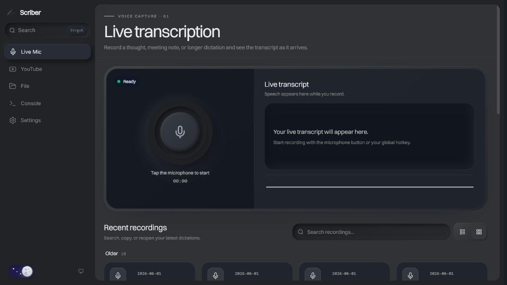
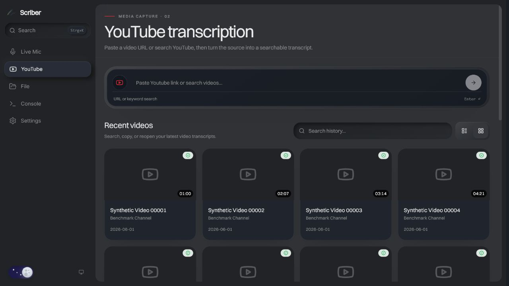
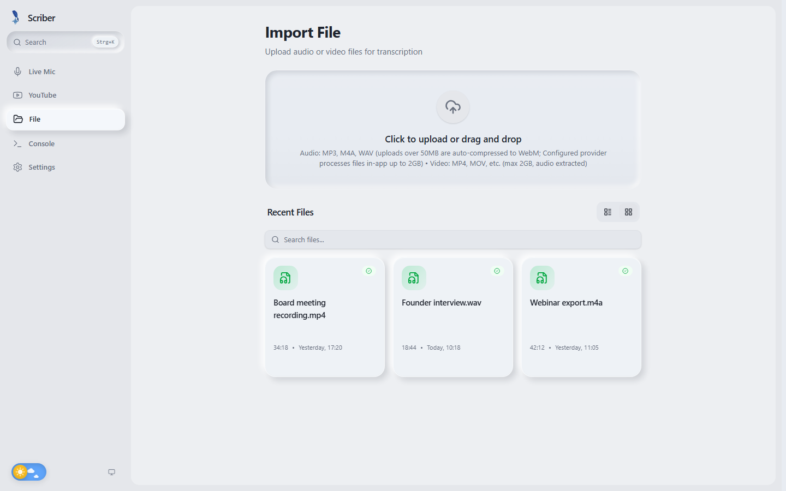
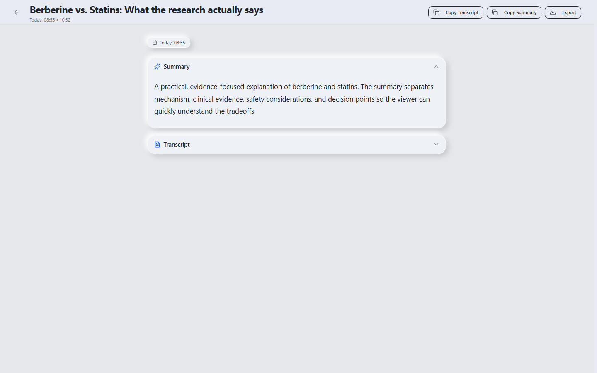
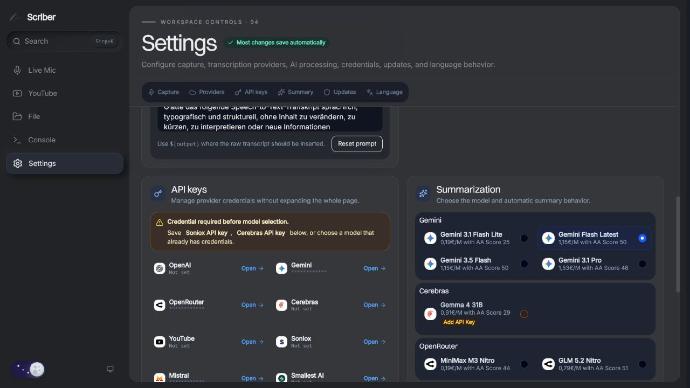

# Scriber

<p align="center">
  
</p>

<h1 align="center">Scriber</h1>

<p align="center">
  <strong>AI-powered voice transcription for desktop and web</strong><br>
  <em>Live-Speech-to-Text, YouTube- und Datei-Transkription, plus Transcript-Management.</em>
</p>

<p align="center">
  <a href="#features">Features</a> •
  <a href="#screenshots">Screenshots</a> •
  <a href="#quick-start">Quick Start</a> •
  <a href="#usage">Usage</a> •
  <a href="#architektur">Architektur</a> •
  <a href="#endpunkte">Endpunkte</a> •
  <a href="#konfiguration">Konfiguration</a> •
  <a href="#troubleshooting">Troubleshooting</a>
</p>

---

## Features

- 🎤 **Live-Mikrofontranskription**
  - Globaler Hotkey (`Ctrl+Alt+S` als Standard) für Start/Stop (`toggle`) oder Press-and-hold (`push_to_talk`).
  - Zwei STT-Modi: Live-Stream über Audio-Frames oder Aufzeichnung + Transkription nach Start.
  - Laufzeitereignisse über WebSocket (`state`, `status`, `transcript`, `audio_level`, `input_warning`, `session_*`, `history_updated`, `error`).
  - Text-Injektion in aktive App: `auto`, `sendinput`, `paste`, `type`.

- 📺 **YouTube-Transkription**
  - Suche über YouTube-API (`search`) und Video-Lookup via URL/ID.
  - Download + Transkriptions-Job (`queued -> transcribing -> completed/failed`).
  - Persistierung als Transcript-Eintrag.

- 📁 **Datei-Transkription**
  - Multipart Upload via `POST /api/file/transcribe`.
  - Unterstützte Dateitypen: `.mp3`, `.m4a`, `.wav`, `.ogg`, `.flac`, `.aac`, `.mp4`, `.mov`, `.webm`, `.avi`, `.mkv`, `.m4v`.
  - Videoformate mit Audio-Extraktion: `.mp4`, `.mov`, `.webm`, `.avi`, `.mkv`, `.flv`, `.wmv`, `.m4v`.
  - Upload-Limits: Audio standardmäßig `200 MB`, Video-Rohdatei standardmäßig `2048 MB`, extrahiertes Audio wird auf `200 MB` begrenzt.

- 🧠 **Mehrere STT-Provider + Fallbacks**
  - Provider: Soniox, Mistral, AssemblyAI, Deepgram, OpenAI, Azure, Gladia, Groq, Speechmatics, ElevenLabs, Google, AWS Transcribe sowie lokale ONNX/NeMo.
  - Zuordnung via `ProviderRouter`, Circuit-Breaker und Retry-Scheduler.
  - Laufende Jobs können nach Neustart des Backends automatisch fortgesetzt werden.

- 🧾 **Transcript-Management**
  - SQLite-Persistenz (`transcripts.db`), Suche, Filter und Paginierung.
  - Export als `pdf` oder `docx`.
  - Manueller oder automatischer Zusammenfassungsfluss (`AUTO_SUMMARIZE`).

- 🖥️ **UI-/Betriebsmodi**
  - Web UI (`Vite`) mit Seiten: Live Mic, YouTube, File, Transcript-Detail, Settings.
  - Tray-Modus (`src.tray`) startet Backend + Web UI.
  - Tkinter-Fallback (`src.main`) wenn kein Frontend/Node vorhanden ist.

- 📦 **Lokale Modelle**
  - ONNX-Modell-Management inkl. Quantisierung (`int8`, `fp16`, `fp32`).
  - NeMo-Modell-Management inkl. Download, Fortschritt und Löschen.
  - Lokale Modelllisten, Status und Events werden von Frontend konsumiert.

---

## Screenshots

### Live Mic Recording
<p align="center">
  
</p>
<p align="center"><em>Live-Aufnahme mit Visualizer, Status und Verlauf</em></p>

### YouTube Transcription
<p align="center">
  
</p>
<p align="center"><em>YouTube-Suche, Transkriptionsstart und Ergebnisübersicht</em></p>

### File Upload
<p align="center">
  
</p>
<p align="center"><em>Drag-and-drop Upload, Fortschritt und Ergebnisliste</em></p>

### Transcript Detail
<p align="center">
  
</p>
<p align="center"><em>Detailansicht mit Summary, Status-Events und Export</em></p>

### Settings
<p align="center">
  
</p>
<p align="center"><em>Provider-, Hotkey-, Modell- und Erweiterungs-Settings</em></p>

---

## Quick Start

### Windows (empfohlen)

```bash
# 1) Repository klonen
git clone https://github.com/MyButtermilk/Scriber.git
cd Scriber

# 2) App starten
start.bat
```

`start.bat` führt aus:

- Python-Prüfung und `venv`-Setup.
- `requirements.txt`-Installation bei Versionsänderung.
- Initiale `.env`-Erstellung bei Bedarf.
- Start via Tray-App, wenn Node + `Frontend/` vorhanden; sonst Fallback auf Tkinter.
- Startprüfung per `http://127.0.0.1:8765/api/health`.
- UI auf `http://localhost:5000`.

### Linux/macOS

```bash
./start.sh
```

`start.sh` installiert Standard-Abhängigkeiten und startet `python -m src.main`.

### Direkter Betrieb

```bash
# Nur Backend
python -m src.web_api

# Nur Frontend-Client (Vite)
cd Frontend
npm install
npm run dev:client      # localhost:5000

# Express-Server (API + Vite-Dev)
npm run dev

# Build/Prod (Frontend)
npm run build
npm start
```

Backend-URL: `http://127.0.0.1:8765`

```bash
# Zusätzlich
python -m src.tray        # Tray + Web UI + Backend
python -m src.main        # Nur Tkinter-Oberfläche
```

---

## Usage

### Web-App Routen

- `/` → Live Mic
- `/youtube` → YouTube
- `/file` → File Transcribe
- `/transcript/:id` → Transcript Detail
- `/settings` → Settings

### Live Mic

- Modus-Setting im UI: `start_stop` (Backend: `toggle`) oder `press_hold` (Backend: `push_to_talk`).
- Start/Stop wird ebenfalls über API bereitgestellt (`/api/live-mic/{start,stop,toggle}`).
- Live-Texte landen als `mic`-Eintrag in der Transcript-Liste.

### YouTube

- `search`, `video` und `transcribe` sind die aktiven Backend-Endpunkte.
- Der Jobverlauf ist in der History sichtbar; Status werden über WebSocket übertragen.

### File Upload

- Endpoint: `POST /api/file/transcribe`, erwartet `multipart/form-data` mit Feld `file`.
- Bei Video-Dateien wird Audio zuerst via ffmpeg extrahiert (WebM/Opus, 16kHz, Mono).
- Audio-Limit nach Extraktion und alle nicht-Video-Dateien: via `SCRIBER_UPLOAD_MAX_MB`/`SCRIBER_UPLOAD_MAX_BYTES`.

### Settings

- Backend liefert und persistiert via Settings-API:
  - Hotkey, Modus, STT-Service, Soniox-Modus/Modelle, Sprache, Mikrofon + Favorit,
    Injection, Zusammenfassung, ONNX/NeMo-Modelle, Visualizer-Bars.
- API-Keys werden gruppiert im Feld `apiKeys` im `GET/PUT /api/settings` verwaltet.
- AWS-Zugang wird (noch) nicht als `apiKeys`-Feld gesetzt, sondern über Standard-AWS-Umgebungsvariablen.

### Tray

- Kontextmenü-Funktionen: Log, Restart, Auto-Start, Öffnen der UI.
- Autostart ist Windows-only via `GET/POST /api/autostart`.

---

## Architektur

```mermaid
graph LR
  U[Browser / Hotkey / Tray] -->|HTTP + WS| F[Tray / Tkinter]
  F --> B[Python Backend
(src.web_api)]
  B --> C[Controller
ScriberWebController]
  C --> R[Pipeline + ProviderRouter]
  C --> D[(SQLite)
transcripts.db]
  C --> J[JobStore
RetryScheduler]
  C --> P[Provider / Local Models
ONNX, NeMo, ffmpeg]
  C <--> W[WebSocket /ws]
  B <--> H[React UI
Frontend/client]
```

### Laufzeitpfade

- **Live Mic:** `POST /api/live-mic/start|stop|toggle` → Pipeline → Live-Events → Persistierung im Transcript-Store.
- **YouTube:** `POST /api/youtube/transcribe` → `download_audio` → Pipeline → Retry/Resume-Mechanik.
- **Datei:** `POST /api/file/transcribe` → Größenprüfung/optional ffmpeg-Extraktion → Pipeline.
- **Frontend-Kommunikation:** REST für Steuerung, WebSocket `/ws` für Status-/Live-Daten.

---

## Endpunkte

### System

- `GET /api/health`
- `GET /api/state`
- `GET /api/metrics/hot-path?limit=n`
  - `limit` wird auf `1..500` geklemmt.

### WebSocket

- `GET /ws`
- Kern-Events (`type`): `state`, `status`, `transcript`, `audio_level`, `input_warning`, `transcribing`, `session_started`, `session_finished`, `history_updated`, `error`.

### Live Mic

- `POST /api/live-mic/start`
- `POST /api/live-mic/stop`
- `POST /api/live-mic/toggle`

### Transkripte

- `GET /api/transcripts?offset={0}&limit={50}&type={mic|youtube|file}&q={query}`
  - `limit` standardmäßig 50, begrenzt auf `1..100`.
- `GET /api/transcripts/{id}`
- `DELETE /api/transcripts/{id}`
- `POST /api/transcripts/{id}/summarize`
- `POST /api/transcripts/{id}/cancel`
- `GET /api/transcripts/{id}/export/{format}` (`format`: `pdf`, `docx`)

### YouTube

- `GET /api/youtube/search?q={query}&maxResults={n}&pageToken={token}`
- `GET /api/youtube/video?id={id}|url={url}`
- `POST /api/youtube/transcribe`

### Datei

- `POST /api/file/transcribe`

### Einstellungen, Geräte, Autostart

- `GET /api/settings`
- `PUT /api/settings`
- `GET /api/microphones`
- `GET /api/autostart`
- `POST /api/autostart`

### Lokale Modelle

- `GET /api/onnx/models`
- `GET /api/onnx/models/{model_id}` (optional `quantization`-Query)
- `POST /api/onnx/download`
- `DELETE /api/onnx/models/{model_id}` (optional `quantization`-Query)
- `GET /api/nemo/models`
- `POST /api/nemo/download`
- `DELETE /api/nemo/models/{model_id}`

---

## Konfiguration

### Basis

```env
SCRIBER_WEB_HOST=127.0.0.1
SCRIBER_WEB_PORT=8765
SCRIBER_ALLOWED_ORIGINS= # optional, default: localhost,127.0.0.1,::1
```

### Frontend

```env
VITE_BACKEND_URL=http://127.0.0.1:8765
PORT=5000
```

### Audio / Verhalten

```env
SCRIBER_HOTKEY=ctrl+alt+s
SCRIBER_MODE=toggle
SCRIBER_DEFAULT_STT=soniox
SCRIBER_SONIOX_MODE=realtime
SCRIBER_SONIOX_ASYNC_MODEL=stt-async-v4
SCRIBER_SONIOX_RT_MODEL=stt-rt-v4
SCRIBER_MISTRAL_RT_MODEL=voxtral-mini-transcribe-realtime-2602
SCRIBER_MISTRAL_ASYNC_MODEL=voxtral-mini-2602
SCRIBER_LANGUAGE=auto
SCRIBER_DEBUG=0
SCRIBER_OPENAI_STT_MODEL=gpt-4o-mini-transcribe-2025-12-15
```

### Mikrofon & Injection

```env
SCRIBER_MIC_DEVICE=default
SCRIBER_FAVORITE_MIC=<Name>
SCRIBER_MIC_ALWAYS_ON=0
SCRIBER_MIC_BLOCK_SIZE=512
SCRIBER_INJECT_METHOD=auto
SCRIBER_PASTE_PRE_DELAY_MS=80
SCRIBER_PASTE_RESTORE_DELAY_MS=1500
```

### Uploads, Jobs, Limits

```env
SCRIBER_UPLOAD_MAX_MB=200
SCRIBER_UPLOAD_MAX_BYTES=
SCRIBER_DOWNLOADS_DIR=./downloads
SCRIBER_JOB_MAX_ATTEMPTS=3
SCRIBER_JOB_RETRY_BASE_SEC=5
SCRIBER_JOB_RETRY_MAX_SEC=120
SCRIBER_TIMEOUT_FILE_TRANSCRIBE_SEC=600
SCRIBER_TIMEOUT_YOUTUBE_TRANSCRIBE_SEC=600
SCRIBER_TIMEOUT_YOUTUBE_DOWNLOAD_SEC=300
```

Hinweis: Videouploads haben intern ein hartes Rohlimit von 2048 MB (WebM/Audio-Extraktion danach 200 MB).

### Summarization

```env
SCRIBER_SUMMARIZATION_PROMPT=...
SCRIBER_SUMMARIZATION_MODEL=gemini-3-flash-preview
SCRIBER_AUTO_SUMMARIZE=1
SCRIBER_SUMMARY_MIN_WORDS=180
SCRIBER_SUMMARY_MAX_WORDS=2200
```

### API-Keys (für Settings/Transkription)

```env
SONIOX_API_KEY=...
MISTRAL_API_KEY=...
ASSEMBLYAI_API_KEY=...
DEEPGRAM_API_KEY=...
OPENAI_API_KEY=...
AZURE_SPEECH_KEY=...
AZURE_SPEECH_REGION=...
GLADIA_API_KEY=...
GROQ_API_KEY=...
SPEECHMATICS_API_KEY=...
ELEVENLABS_API_KEY=...
GOOGLE_API_KEY=...
GOOGLE_APPLICATION_CREDENTIALS=/path/to/credentials.json
YOUTUBE_API_KEY=...
SCRIBER_VISUALIZER_BAR_COUNT=60
```

AWS nutzt derzeit Standard-Umgebungsvariablen (nicht über `apiKeys` im Settings-JSON):

```env
AWS_ACCESS_KEY_ID=...
AWS_SECRET_ACCESS_KEY=...
AWS_REGION=...
```

### ONNX / NeMo

```env
SCRIBER_ONNX_MODEL=nemo-parakeet-tdt-0.6b-v3
SCRIBER_ONNX_QUANTIZATION=int8
SCRIBER_ONNX_USE_GPU=0
SCRIBER_NEMO_MODEL=parakeet-primeline
```

`settings.json` enthält den persistierten `summarizationPrompt`.

---

## Projektstruktur

```text
Scriber/
├── src/
│   ├── web_api.py            # aiohttp REST + WebSocket API
│   ├── pipeline.py           # STT-Pipeline / Provider-Auswahl
│   ├── config.py             # Env + Settings
│   ├── tray.py               # Tray, Menüs, Autostart, Hotkeys
│   ├── database.py           # SQLite (transcripts.db)
│   ├── export.py             # PDF/DOCX Export
│   ├── overlay.py            # Recording-Overlay
│   ├── summarization.py      # Zusammenfassung
│   ├── youtube_api.py        # YouTube-Suche / Video-Metadaten
│   ├── youtube_download.py   # Audio Download von Video
│   ├── onnx_local_service.py # ONNX STT
│   ├── nemo_local_service.py # NeMo STT
│   ├── main.py               # Tkinter-Fallback UI
│   └── microphone.py         # Mikrofoneingabe
├── Frontend/
│   ├── client/              # React + Wouter + React Query + WS
│   ├── server/              # Express/Dev/Vite Host
│   └── shared/              # Shared Types / Schema
├── docs/
│   └── screenshots/         # README-Grafiken
├── start.bat
├── start.sh
├── requirements.txt
└── README.md
```

---

## Troubleshooting

- Backend startet nicht
  - `python -m src.web_api` manuell starten und Log prüfen.
- Web-UI lädt nicht
  - Prüfen, ob Backend auf `http://127.0.0.1:8765/api/health` läuft.
- Kein Mikrofon verfügbar
  - `GET /api/microphones` testen und Mikrophoneinstellung prüfen.
- YouTube-Transkription ohne Zugriff
  - `YOUTUBE_API_KEY` in `.env`/Settings setzen.
- Datei-/Video-Upload schlägt fehl
  - Format/Limits prüfen (`200 MB` Audio, `2048 MB` Roh-Video).
- Modelle werden nicht angezeigt
  - `ffmpeg` bzw. `onnx-asr`/`nemo_stt`-Abhängigkeiten prüfen.

---

## Tests / Qualitätscheck

```bash
# Python
pytest

# Frontend
cd Frontend
npm run check
```

---

## Lizenz

MIT License – siehe [LICENSE](LICENSE).

---

<p align="center">Efficient, resumable, multi-provider speech-to-text workflows.</p>
