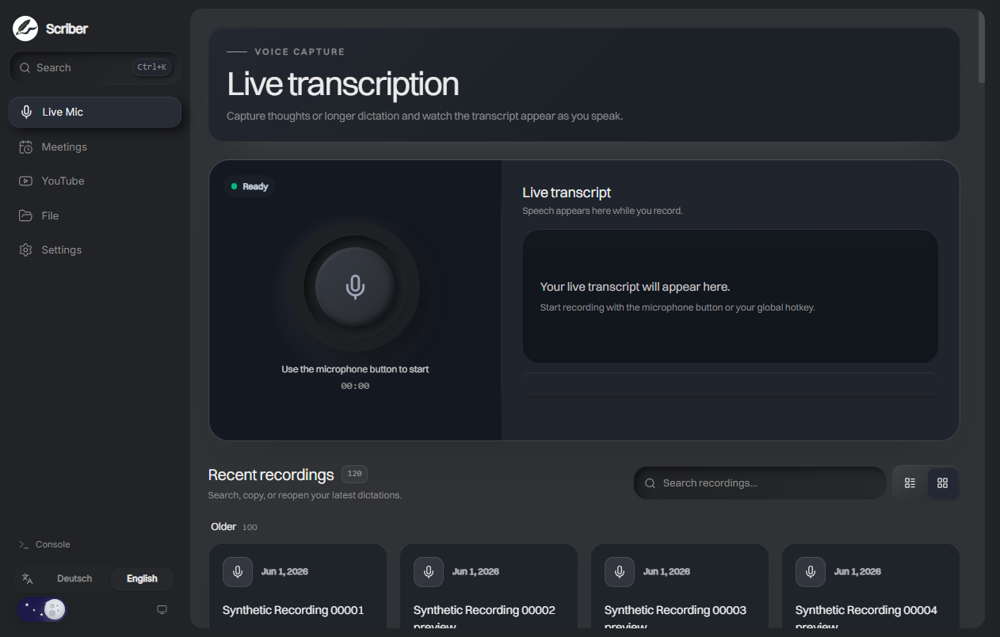
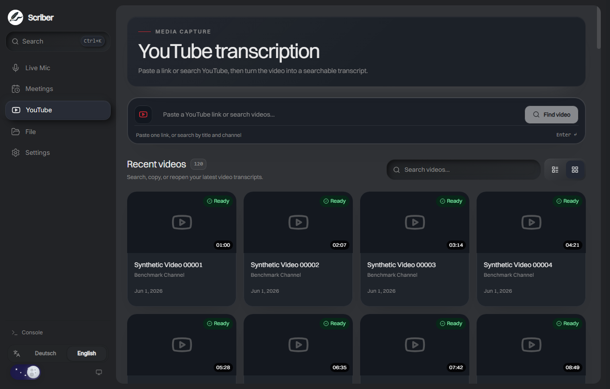
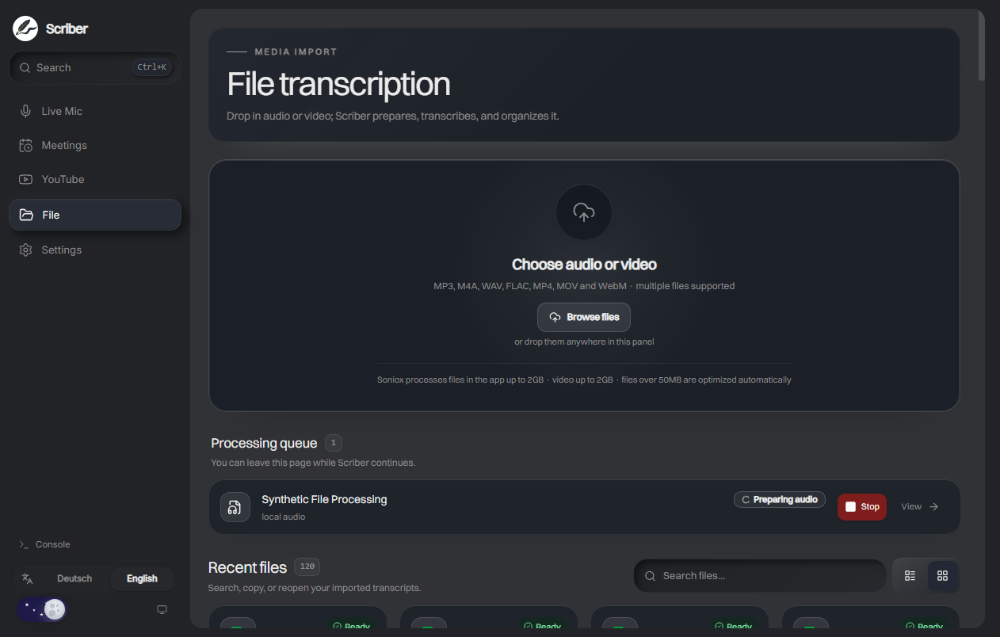
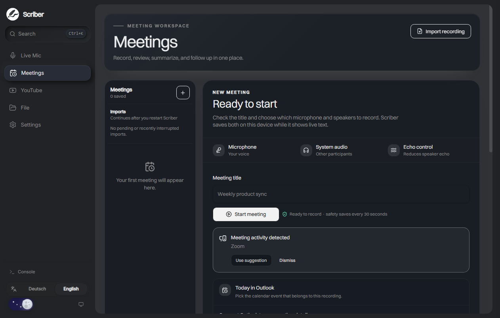
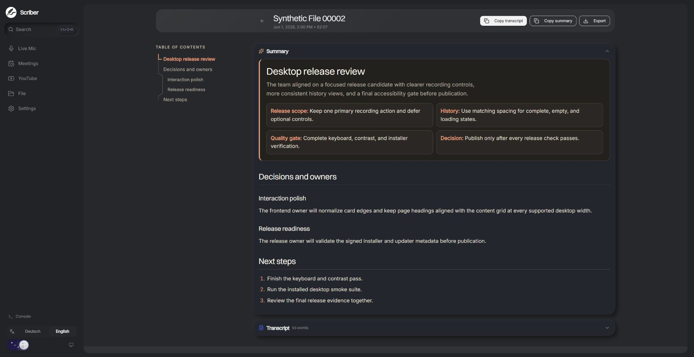
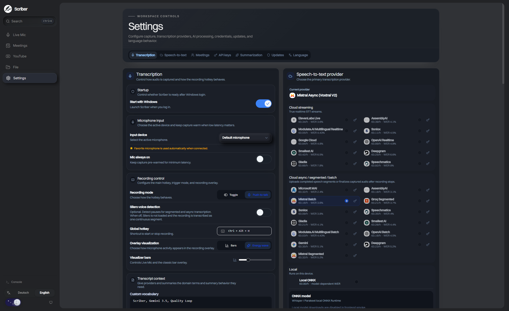
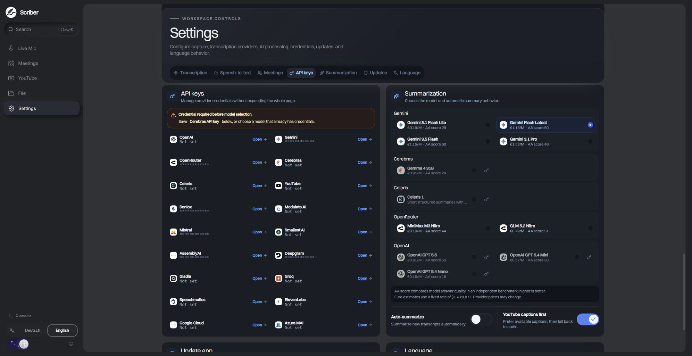
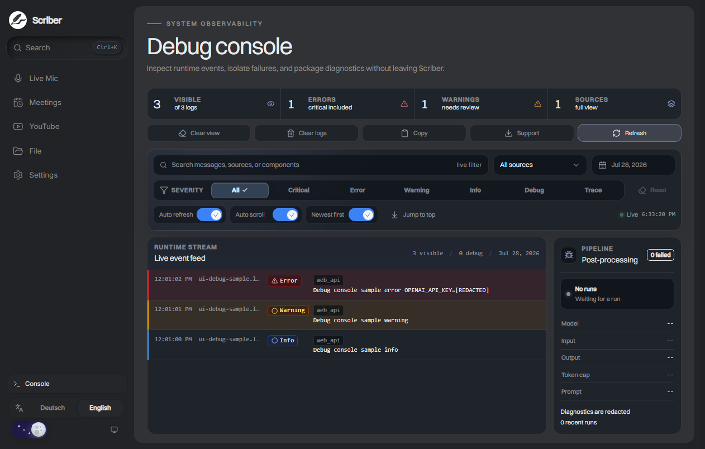

<p align="center">
  
</p>

<h1 align="center">Scriber</h1>

<p align="center">
  <strong>Turn live speech, bot-free meetings, YouTube videos, and media files into useful text from one Windows workspace.</strong>
</p>

<p align="center">
  Dictate into any app. Capture calls without a joining bot. Keep every transcript searchable. Choose the cloud or local model that fits the job.
</p>

<p align="center">
  <a href="https://github.com/MyButtermilk/Scriber/releases/latest">
    
  </a>
</p>

<p align="center">
  <a href="https://github.com/MyButtermilk/Scriber/releases/latest"></a>
  <a href="https://github.com/MyButtermilk/Scriber/actions/workflows/release-windows.yml"></a>
  
</p>



## Latest highlights

- **Bot-free Meetings:** record microphone and Windows system audio on one
  timeline, remove speaker echo with AEC3, and create transcripts, summaries,
  decisions, action items, cited answers, and reusable exports.
- **Smarter speaker workflows:** use provider-native speaker turns or optional
  offline Sherpa-ONNX diarization, then confirm names with Meeting-local labels,
  an opt-in Voice Library, and optional Outlook Calendar context.
- **Faster everyday dictation:** separate global shortcuts for faithful text and
  prompt-driven post-processing, backed by native WASAPI capture, mic
  pre-warming, a responsive recording overlay, and optional local transcript
  polishing with a downloadable GGUF model.
- **More provider choice:** multilingual Modulate.AI batch and realtime
  transcription, Soniox US/EU routing, cloud streaming and batch providers, and
  downloadable local ONNX models share the same workflow.
- **Richer results:** German and English interface localization, synchronized
  summary navigation, transcript search, and polished PDF/DOCX export across
  Live Mic, Meetings, YouTube, and File.

## One desktop. Every spoken workflow.

Scriber is not another upload page wrapped around one speech API. It is a Windows-first transcription workspace for the moments before, during, and after speech becomes text.

|  | Typical transcription tools | Scriber |
| --- | --- | --- |
| **Live dictation** | Text stays inside the recorder | A global hotkey records, transcribes, and pastes into the app you are already using |
| **Input sources** | Meetings, files, or YouTube as separate products | Meetings, live microphone, YouTube, and local media share one workspace |
| **Model choice** | One vendor decides quality, latency, and price | Switch between streaming, async, batch, and local ONNX providers |
| **YouTube** | Always download and transcribe audio | Prefer captions first, then fall back to audio automatically |
| **After transcription** | Copy raw text and leave | Search, summarize, post-process, export, copy, and reopen later |
| **Desktop integration** | Browser tab and manual uploads | Native tray, hotkeys, autostart, overlay, updater, and supervised backend |
| **Troubleshooting** | Generic error message | Filtered runtime logs, redacted diagnostics, and support bundles |

## Built around the way you capture information

### 🎙️ Dictate into any Windows app

Use the normal hotkey for fast, faithful speech-to-text. Use the separate post-processing hotkey when the result should be cleaned, structured, and ready to send.

- Ready-to-use defaults on a fresh install: **Ctrl+Shift+D** for Live Mic and
  **Ctrl+Shift+F** for post-processing; existing Settings or `.env` choices are
  preserved
- Rust and WASAPI microphone capture
- Optional microphone pre-warming for lower startup latency
- Native recording overlay with selectable classic bars or an audio-reactive
  energy wave
- Raw dictation or cloud/local prompt-driven post-processing
- Cloud post-processing keeps provider fallback inside a short bounded deadline
  and then inserts the raw transcript instead of delaying through a long serial
  retry chain; repeatedly rejected credentials are skipped on subsequent
  dictations until their key/model changes or Scriber restarts. Settings lets
  you choose the OpenRouter fallback model. Whenever that fallback actually
  completes a dictation, Scriber shows a native Windows toast even while the
  main window is hidden; browser and shell-failure paths retain an in-app toast
- Clipboard-aware insertion with bounded clipboard restoration
- Searchable recent recordings with useful transcript excerpts

### ▶️ YouTube captions when possible. Audio when needed.

Paste a video URL, search YouTube inside Scriber, or hand the current video over
from Chrome without copying the URL. Creator captions and automatic captions are
tried first, which can make a transcript available faster and avoid unnecessary
provider cost. If captions are unavailable, Scriber prepares the audio and
continues automatically.



- Caption-first behavior is configurable under **Settings > Summarization**
- Current yt-dlp extraction with EJS and a bundled offline QuickJS-ng wrapper
- Bundled ffmpeg and ffprobe media preparation
- Durable progress, retry, cancel, and recovery state
- Transcript and summary saved beside every other source

#### Start directly from a YouTube page in Chrome

The Manifest V3 extension is directly loadable from
`browser-extension/chrome`; it does not need a Scriber API key or access to the
local backend port.

1. Install a Scriber build that contains the `scriber://` browser handoff.
2. Open `chrome://extensions`, enable **Developer mode**, choose **Load
   unpacked**, and select `browser-extension/chrome`.
3. Open a YouTube video and choose **Mit Scriber transkribieren** beside the
   video actions. The extension toolbar popup provides the same handoff.
4. Confirm Chrome's **Open Scriber** prompt on first use. Scriber opens the
   queued transcript immediately and keeps showing progress through completion.

The link carries only the public YouTube video ID plus the visible title and
channel. Scriber validates that exact contract in the desktop shell; the
session token never leaves the app.

Privacy details are documented in the
[Chrome extension privacy policy](docs/CHROME_EXTENSION_PRIVACY.md).

### 📁 Bring recordings in without upload gymnastics

Drop in audio, video, or several files at once. Scriber extracts audio, compresses large inputs when useful, tracks the queue, and keeps completed work organized.



- MP3, M4A, WAV, MP4, MOV, and other common media formats
- Multi-file batch import
- Automatic audio extraction from video
- Provider-aware preparation for large inputs
- Progress, cancellation, retry, and durable job state
- PDF and DOCX export from completed transcripts

### 👥 Capture meetings without a joining bot

The Meetings workspace records microphone and Windows system audio locally while
the call is in progress. WebRTC AEC3 uses the system-audio reference to remove
speaker echo from the microphone track; the raw source is still retained for
recovery. After stop, Scriber creates a timestamped canonical transcript,
summary, decisions, action items, cited chat answers, and reusable exports.



- Independent raw mic, AEC-clean mic, and system tracks on one timeline
- Crash-safe chunks, pause/resume gaps, startup recovery, and configurable audio retention
- Provider-native timestamps and speaker turns where supported
- Optional offline Sherpa-ONNX speaker separation for STT models without native
  diarization; the signed app supplies an isolated static worker while only the
  models are downloaded, shared by File, YouTube, Meetings, and Meeting imports
- Import an existing audio or video recording directly into the Meeting workspace
- **Ctrl+Shift+M** opens, restores, and focuses the Meeting workspace on a fresh
  install; an existing custom shortcut remains unchanged
- Optional local speaker library with explicit biometric opt-in and deletion
- Optional Outlook Calendar connection with a refreshable list of today's
  events from one calendar selected in Settings (the personal default calendar
  is selected automatically),
  organizer and attendee details, and an explicit event/no-event choice;
  the selected details are frozen with the Meeting and no bot joins the call.
  Scriber shows when the calendar was last refreshed, warns if a selected event
  was moved or removed, and offers a clear reconnect path when Microsoft access
  expires.
- Voice Library and local-account matches are suggested first after the Meeting;
  optional AI suggestions for unresolved speakers always require confirmation
- Name unresolved speakers directly in the Meeting, including people, teams,
  rooms, or shared microphones. These meeting-local labels do not create Outlook
  identities, rename Voice Library profiles, or add email recipients
- Permanently merge duplicate speaker identities when one person was detected as
  two speakers; Scriber preserves explicitly assigned Meeting labels and asks for
  confirmation before changing the local Voice Library
- Email drafts reuse the selected event's suitable participant addresses and
  show recipients for review before sending
- Markdown, JSON, PDF, DOCX, multitrack FLAC, and synchronized Opus playback

## ✨ The transcript is the beginning, not the result

Every source lands in the same local transcript library. From there, Scriber helps turn raw speech into something you can actually use.



- Search across live recordings, Meetings, YouTube videos, and imported files
- Automatic or manual summaries
- Follow structured File and YouTube summaries with a scroll-synchronized table of contents whose label follows the summary language
- Separate models and prompts for summaries and live post-processing
- Copy transcript or summary independently
- Export polished results to PDF or DOCX
- Preserve speaker labels for supported diarized batch providers
- Reopen processing, failed, stopped, summary-failed, and completed jobs with clear state

## Choose the model. Keep the workflow.

Latency, accuracy, price, privacy, and language support vary by task. Scriber keeps the workflow stable while you choose the provider.



### Cloud streaming

Use a realtime provider when words should appear while you speak.

### Cloud async and batch

Use completed-audio processing for long recordings, file imports, and providers optimized for accuracy or cost.

### Microsoft MAI through Azure or one OpenRouter key

Microsoft MAI Transcribe 1.5 can use either the separate direct Azure setup or
the OpenRouter option. With OpenRouter, the same API key covers MAI
transcription and Scriber's existing OpenRouter summaries and post-processing.
OpenRouter currently charges **5.5% (minimum $0.80) on standard credit
purchases** or **5% on cryptocurrency purchases**; this is an account-funding
fee, not a markup on the model's inference price.
[See the OpenRouter model page.](https://openrouter.ai/microsoft/mai-transcribe-1.5)
[See the OpenRouter fee details.](https://openrouter.ai/docs/faq)

### Modulate.AI multilingual transcription

Modulate.AI is available for multilingual batch and realtime transcription.
Scriber keeps only final transcript text: partial results and optional emotion,
accent, deepfake, and PII/PHI signals are disabled. The provider's published base
prices are **$0.03 per audio hour** for batch and **$0.06 per audio hour** for
streaming, without optional add-ons. Settings uses **4.43% word error rate** as
the comparison benchmark and sorts models by their displayed error rate.
[See Modulate's official API pricing.](https://www.modulate.ai/api-pricing)
[Transcription quick start.](https://docs.modulate.ai/quickstart)

### Soniox US and EU regions

Soniox defaults to its US region. Open the Soniox API-key popup in Settings to
switch both realtime and uploaded-audio transcription to the EU region. EU
access must first be enabled for your Soniox organization: contact
[support@soniox.com](mailto:support@soniox.com), create an EU project, and use
that project's region-specific API key. The region selection and key must match;
a US project key does not provide EU data residency.
[Read the official Soniox data-residency guide.](https://soniox.com/docs/data-residency)

### Local ONNX

Download supported ONNX models from Settings and transcribe locally without an STT API key. Scriber uses prepared model artifacts rather than asking end users to install or run NeMo and Torch.

### Local transcript polishing (GGUF)

Download the public polishing model directly in Settings without a Hugging Face
account. **Q8_0** is the recommended desktop/laptop variant; **BF16** is the
larger reference option for systems with more memory. Both run through the same
bundled llama.cpp runtime, prefer Vulkan acceleration, and fall back to CPU.
This text-cleanup path uses GGUF, not ONNX, and never downloads executable code
from the model repository.

Current provider coverage includes Soniox, Modulate.AI, AssemblyAI, Microsoft
MAI through direct Azure or OpenRouter, OpenAI, Celeris, Deepgram, Mistral,
Gladia, Groq, Speechmatics, Smallest AI, ElevenLabs, Gemini 3.5 Transcribe
(async and live), Google Cloud, and ONNX.

## 🔑 Credentials and AI behavior stay understandable

Provider credentials, transcription models, summary models, prompts, language behavior, and update controls live in one Settings workspace. Unavailable cloud models remain visibly gated until the matching credential exists; public local polishing downloads do not require credentials.



- Credential status and direct provider links
- Separate STT, summarization, primary post-processing, and post-processing
  fallback model choices
- Practical price and error estimates where benchmark data is available
- Custom vocabulary for names, brands, and domain language
- Automatic summarization and caption-first controls
- Gemini, Meta Muse Spark, OpenRouter, OpenAI, Cerebras, and Celeris summary paths. Scriber does not send an
  application-defined maximum output-token value for File, YouTube, or Meeting summaries; the selected model
  decides the required response length, while incomplete provider responses are rejected instead of saved.
- Muse Spark Contributor may allow Meta to use prompts and responses to improve future Meta models. Scriber
  marks this tier clearly and does not recommend it for sensitive or confidential content.
- Light, dark, and system theme support
- Complete German and English interface with a persistent language switch in
  the app shell and Settings; transcription-language choices remain separate
  from the interface language

## 🛡️ Local-first where it matters

Scriber runs its desktop shell, frontend, backend, transcript database, settings, and history on your machine.

| Data | What happens |
| --- | --- |
| **Transcript history** | Stored locally in Scriber's user data directory |
| **Microphone and media** | Sent only when the selected transcription provider is cloud-based |
| **Summaries and post-processing** | Text is sent only to the model provider you choose for that action |
| **Local transcript polishing** | Runs on this device after the public GGUF model download; no Hugging Face account is required |
| **Local ONNX transcription** | Runs without an STT API key |
| **Credentials** | Stored for the configured provider and redacted from support diagnostics |
| **Support bundles** | Known API keys, bearer tokens, and session secrets are redacted |

Scriber does not require a Scriber account. Cloud providers still apply their own pricing, retention, and privacy terms.

## 🧰 A debugging console you can actually use

Transcription crosses microphones, media tools, model APIs, networking, and desktop integration. Scriber makes those boundaries visible without exposing raw transcript content in diagnostics.



- Severity, source, date, component, and message filters
- Clear selected view or persisted runtime logs
- Copy visible diagnostics
- Generate a redacted support bundle; the Windows app asks where to save it and
  then offers Open file, Open folder, and Copy file actions
- Inspect post-processing health without logging transcript text
- Track live runtime state and provider failures

## Windows-native by design

The installed app is more than a packaged website:

- **Tauri 2 shell** for tray actions, autostart, global shortcuts, single-instance behavior, updates, and backend supervision
- **Rust audio sidecar** for crash-isolated WASAPI microphone capture and pre-warming
- **React workspace** for fast navigation across Live Mic, Meetings, YouTube, File, Settings, Console, and transcript details
- **Python backend sidecar** for provider routing, job state, summaries, local storage, and support tooling
- **Bundled media stack** with ffmpeg, ffprobe, yt-dlp extraction support, and a bounded QuickJS-ng runtime
- **Signed updater artifacts** with published checksums and release diagnostics

## Download and start

<p>
  <a href="https://github.com/MyButtermilk/Scriber/releases/latest">
    
  </a>
</p>

1. Download the latest Windows installer.
2. Open **Settings** and choose a transcription provider.
3. Add the matching API key, or download a local ONNX transcription/GGUF polishing model.
4. Start with a short Live Mic recording, then try YouTube or a media file.

The standard installer includes the desktop shell, frontend, backend sidecar, Rust audio sidecar, and media tools needed for normal use.

> **Windows is the primary supported platform.** Linux and macOS paths are intended mainly for development and fallback use today.

## Frequently asked questions

<details>
<summary><strong>Can I use Scriber without an API key?</strong></summary>

Yes. Choose a supported local ONNX transcription model and/or the public local
GGUF polishing model. Neither local download requires a Hugging Face account.
Cloud transcription, summarization, and post-processing still require the
credentials of the provider you select.
</details>

<details>
<summary><strong>Does YouTube transcription always download the video?</strong></summary>

No. Caption-first mode checks useful creator and automatic caption tracks first. Audio is prepared only when captions are disabled or unavailable.
</details>

<details>
<summary><strong>Can I use different models for transcription and summaries?</strong></summary>

Yes. Speech-to-text, summarization, and live post-processing have separate model and prompt choices.
</details>

<details>
<summary><strong>Where are my transcripts stored?</strong></summary>

Transcript history and runtime data stay in Scriber's local user data directory. Selected cloud features send only the audio or text required by that provider action.
</details>

<details>
<summary><strong>What should I try first?</strong></summary>

For a simple cloud setup, configure a Gemini API key for Gemini 3.5 Transcribe
(async or live) and summaries. For local transcription, download an ONNX model
from Settings.
</details>

## For developers

<details>
<summary><strong>Architecture, setup, build, and test commands</strong></summary>

### Requirements

- Windows 10 or newer for the primary desktop runtime
- Python 3.14.7
- Node.js 26.5.0 and npm
- Stable Rust toolchain
- Git

### Start the desktop app in development

```powershell
git clone https://github.com/MyButtermilk/Scriber.git
cd Scriber\Frontend
npm install
npm run tauri:dev
```

Run the backend and frontend separately when you are working on one layer:

```powershell
cd Scriber
py -3.14 -m venv venv
venv\Scripts\python.exe -m pip install -r requirements.txt
scripts\project-python.cmd -m src.web_api
```

```powershell
cd Scriber\Frontend
npm install
npm run dev:client
```

### Build a Windows installer

```powershell
powershell -NoProfile -ExecutionPolicy Bypass -File scripts\build_windows.ps1 `
  -FastLocalInstaller `
  -RunInstallerFrontendSmoke `
  -RunInstallerMediaPreparationSmoke
```

The NSIS installer is written to:

```text
Frontend\src-tauri\target\release\bundle\nsis\
```

Windows releases use exact CPython 3.14.7. The conservative product default is
the official runtime with JIT disabled; JIT and custom Clang/PGO/tail-call
variants remain internal, installed-performance experiments and are not user
settings. The stock PyInstaller 6.20 frozen interpreter currently ignores
`PYTHON_JIT`, so JIT-on variants fail closed instead of being shipped.

### Test

Ruff is intentionally separate from the Windows test dependency closure.
Install the CI-pinned version once in Scriber's project environment:

```powershell
scripts\project-python.cmd -m pip install ruff==0.15.22
```

```powershell
scripts\project-python.cmd -m pytest -n 4 --dist loadfile -ra
scripts\project-python.cmd -m ruff check src tests scripts
scripts\project-python.cmd -m ruff format --check src tests scripts
scripts\project-python.cmd -m mypy src\api src\core src\runtime src\data
```

```powershell
cd Frontend
npm run check
npm test
npm run build
```

```powershell
cd Frontend\src-tauri
cargo test
```

Run the real-browser frontend smoke against its privacy-safe synthetic backend:

```powershell
scripts\project-python.cmd scripts\smoke_frontend_browser.py --output tmp\frontend-browser-smoke.json
```

For the File-ingest vertical slice, run Chrome and the real React/Vite frontend
against the production `src.web_api.create_app` composition and durable
`JobStore`:

```powershell
scripts\project-python.cmd scripts\smoke_real_file_upload_browser.py --output tmp\real-file-browser-smoke.json
```

This smoke stops at the durable queued boundary. It does not claim an installed
Tauri build or an external-provider transcription.

### Active documentation

- [`AGENTS.md`](AGENTS.md): repository editing guide and non-negotiable contracts
- [`docs/ARCHITECTURE.md`](docs/ARCHITECTURE.md): runtime architecture and ownership boundaries
- [`docs/PERFORMANCE_AND_PACKAGING.md`](docs/PERFORMANCE_AND_PACKAGING.md): performance and installer decisions
- [`docs/TESTING_AND_RELEASE.md`](docs/TESTING_AND_RELEASE.md): smoke gates, signing, updater, and release flow
- [`docs/ROADMAP_AND_KNOWN_ISSUES.md`](docs/ROADMAP_AND_KNOWN_ISSUES.md): prioritized next work and open issues

</details>

---

<p align="center">
  <strong>Speech becomes valuable when it can move.</strong><br>
  Capture it once. Search it, shape it, and use it anywhere.
</p>
