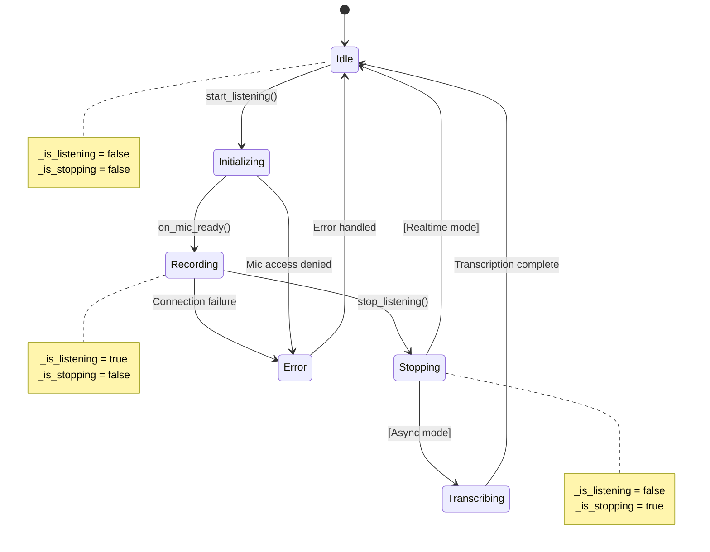
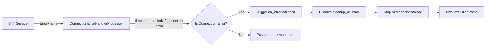

# Scriber Recording Pipeline Architecture

This document describes the complete flow from clicking the record icon to the final pasting of the transcript.

## Table of Contents

1. [Overview](#overview)
2. [Sequence Diagram](#sequence-diagram)
3. [State Machine](#state-machine)
4. [Threading Model](#threading-model)
5. [Error Handling Scenarios](#error-handling-scenarios)
6. [Frontend Trigger](#1-frontend-trigger)
7. [Backend WebSocket Handler](#2-backend-websocket-handler)
8. [Pipeline Initialization](#3-pipeline-initialization)
9. [Microphone Capture](#4-microphone-capture)
10. [Pipeline Construction & Audio Flow](#5-pipeline-construction--audio-flow)
11. [STT Service Processing](#6-stt-service-processing)
12. [Transcription Callback Chain](#7-transcription-callback-chain)
13. [Text Injection](#8-text-injection)
14. [Stop Flow](#9-stop-flow)
15. [Timeline Summary](#timeline-summary)
16. [Technical Specifications](#technical-specifications)

---

## Overview

```
┌─────────────────────────────────────────────────────────────────────────────┐
│                           SCRIBER PIPELINE FLOW                              │
├─────────────────────────────────────────────────────────────────────────────┤
│                                                                              │
│  [Click Record]                                                              │
│       │                                                                      │
│       ▼                                                                      │
│  ┌─────────────┐    WebSocket     ┌──────────────────┐                      │
│  │   Frontend  │ ◄──────────────► │   web_api.py     │                      │
│  │ (React UI)  │                  │ (ScriberWebCtrl) │                      │
│  └─────────────┘                  └────────┬─────────┘                      │
│                                            │                                 │
│                                            ▼                                 │
│                                   ┌──────────────────┐                      │
│                                   │  ScriberPipeline │                      │
│                                   └────────┬─────────┘                      │
│                                            │                                 │
│       ┌────────────────────────────────────┼────────────────────────────┐   │
│       │                         PIPECAT PIPELINE                         │   │
│       │                                    │                             │   │
│       │    ┌───────────────┐    ┌─────────▼─────────┐    ┌───────────┐ │   │
│       │    │ MicrophoneInput│───►│  SonioxSTTService │───►│ErrorHandler│ │   │
│       │    │ (Audio Capture)│    │  (Transcription)  │    │           │ │   │
│       │    └───────────────┘    └───────────────────┘    └─────┬─────┘ │   │
│       │                                                        │       │   │
│       │    ┌───────────────┐    ┌───────────────────┐         │       │   │
│       │    │  TextInjector │◄───│TranscriptionCB    │◄────────┘       │   │
│       │    │ (Paste Text)  │    │  Processor        │                 │   │
│       │    └───────┬───────┘    └───────────────────┘                 │   │
│       │            │                                                   │   │
│       └────────────┼───────────────────────────────────────────────────┘   │
│                    │                                                        │
│                    ▼                                                        │
│           [Text Pasted to Active App]                                       │
│                                                                              │
└─────────────────────────────────────────────────────────────────────────────┘
```

---

## Sequence Diagram

```mermaid
sequenceDiagram
    autonumber
    participant U as User
    participant F as Frontend<br/>(React)
    participant W as web_api.py<br/>(WebSocket)
    participant P as ScriberPipeline
    participant M as MicrophoneInput
    participant S as STT Service<br/>(Soniox/etc)
    participant I as TextInjector

    rect rgb(40, 60, 40)
    note right of U: Recording Start
    U->>F: Click Record / Hotkey
    F->>W: POST /api/live-mic/start
    W->>W: Acquire _listening_lock
    W->>W: Create TranscriptRecord
    W->>P: new ScriberPipeline()
    W->>F: session_started (WebSocket)
    
    P->>M: Create MicrophoneInput
    P->>S: Create STT Service
    M->>M: Start sounddevice.InputStream
    M-->>P: on_mic_ready()
    P-->>W: on_status_change("Listening")
    W-->>F: status update (WebSocket)
    end

    rect rgb(40, 40, 60)
    note right of U: Audio Capture Loop
    loop Every ~32ms
        M->>M: Audio callback (sounddevice thread)
        M->>M: Calculate RMS
        M-->>W: on_audio_level(rms)
        W-->>F: audio_level (WebSocket)
        M->>P: InputAudioRawFrame
        P->>S: Audio data (WebSocket)
    end
    end

    rect rgb(60, 40, 40)
    note right of U: Transcription Flow
    S-->>P: InterimTranscriptionFrame
    P-->>W: on_transcription(text, false)
    W-->>F: transcript (interim)
    
    S-->>P: TranscriptionFrame (final)
    P-->>W: on_transcription(text, true)
    W-->>F: transcript (final)
    P->>I: TranscriptionFrame
    I->>I: Inject text (clipboard paste)
    end

    rect rgb(60, 60, 40)
    note right of U: Recording Stop
    U->>F: Click Stop / Release Hotkey
    F->>W: POST /api/live-mic/stop
    W->>W: Set _is_stopping = true
    W->>P: stop()
    P->>M: Stop audio stream
    P->>S: Send stop signal ("")
    S-->>P: Final tokens
    P->>I: flush() buffered text
    P-->>W: Pipeline stopped
    W->>W: Save transcript to DB
    W-->>F: session_finished (WebSocket)
    end
```



---

## State Machine

The pipeline uses a state machine to manage recording sessions and prevent race conditions.

### Controller States



### State Flags

| State | `_is_listening` | `_is_stopping` | Description |
|-------|-----------------|----------------|-------------|
| **Idle** | `false` | `false` | Ready to start new recording |
| **Recording** | `true` | `false` | Actively capturing audio |
| **Stopping** | `false` | `true` | Graceful shutdown in progress |
| **Error** | `false` | `false` | Reset after error handling |

### Session Correlation

Live mic sessions are keyed by `sessionId` (the `TranscriptRecord.id`). All live-mic WebSocket
messages include this ID so the frontend can ignore stale events from a previous session when
the hotkey is toggled rapidly.

### Guard Conditions

```python
# Prevents duplicate starts
if self._is_listening or self._is_stopping:
    return  # Already recording or stopping

# Prevents duplicate stops
if not self._is_listening:
    return  # Not recording

# Atomic state transition
async with self._listening_lock:
    self._is_stopping = True
    self._is_listening = False
```

---

## Threading Model

The pipeline uses multiple threads and async tasks for efficient audio processing.

### Thread Architecture

```
┌─────────────────────────────────────────────────────────────────────────────┐
│                              THREADING MODEL                                 │
├─────────────────────────────────────────────────────────────────────────────┤
│                                                                              │
│  ┌─────────────────────────────────────────────────────────────────────┐    │
│  │                     MAIN ASYNCIO EVENT LOOP                          │    │
│  │                                                                       │    │
│  │  • WebSocket message handling (web_api.py)                           │    │
│  │  • HTTP request handlers                                              │    │
│  │  • Pipeline coordination (start/stop)                                 │    │
│  │  • Broadcast to WebSocket clients                                     │    │
│  │  • Database operations                                                │    │
│  │                                                                       │    │
│  └───────────────────────────────┬───────────────────────────────────────┘    │
│                                  │                                           │
│               call_soon_threadsafe()                                         │
│                                  │                                           │
│  ┌───────────────────────────────┼───────────────────────────────────────┐    │
│  │             SOUNDDEVICE AUDIO CALLBACK THREAD                          │    │
│  │                               │                                        │    │
│  │  • Called every ~32ms by OS audio subsystem                           │    │
│  │  • Captures 512 samples (1024 bytes)                                  │    │
│  │  • Calculates RMS for visualization                                   │    │
│  │  • Queues audio bytes via call_soon_threadsafe()                      │    │
│  │  • Must return quickly (<10ms) to avoid audio glitches               │    │
│  │                               │                                        │    │
│  └───────────────────────────────┴───────────────────────────────────────┘    │
│                                                                              │
│  ┌─────────────────────────────────────────────────────────────────────┐    │
│  │                      ASYNCIO TASK: _drain_queue()                     │    │
│  │                                                                       │    │
│  │  • Consumes audio from asyncio.Queue                                  │    │
│  │  • Creates InputAudioRawFrame                                         │    │
│  │  • Pushes to pipeline (STT service)                                   │    │
│  │                                                                       │    │
│  └─────────────────────────────────────────────────────────────────────┘    │
│                                                                              │
│  ┌─────────────────────────────────────────────────────────────────────┐    │
│  │                      ASYNCIO TASK: STT WebSocket                      │    │
│  │                                                                       │    │
│  │  • Sends audio to cloud STT service                                   │    │
│  │  • Receives interim/final transcriptions                              │    │
│  │  • Handles connection keepalive                                       │    │
│  │                                                                       │    │
│  └─────────────────────────────────────────────────────────────────────┘    │
│                                                                              │
│  ┌─────────────────────────────────────────────────────────────────────┐    │
│  │                 BACKGROUND THREAD: Text Injection                     │    │
│  │                                                                       │    │
│  │  • Clipboard operations (save/restore)                                │    │
│  │  • SendInput API calls                                                │    │
│  │  • Keyboard simulation                                                │    │
│  │  • Runs in separate thread to not block pipeline                      │    │
│  │                                                                       │    │
│  └─────────────────────────────────────────────────────────────────────┘    │
│                                                                              │
└─────────────────────────────────────────────────────────────────────────────┘
```

### Thread-Safe Communication

| From | To | Mechanism |
|------|----|-----------|
| Audio callback → Event loop | `asyncio.Queue` via `call_soon_threadsafe()` |
| Event loop → WebSocket clients | `asyncio.create_task(broadcast())` |
| Transcription → Text injection | Direct call (same thread) or `threading.Timer` for clipboard restore |
| Error handler → Cleanup | Synchronous callback in pipeline thread |

### Critical Timing Constraints

| Operation | Max Time | Consequence if Exceeded |
|-----------|----------|-------------------------|
| Audio callback | <10ms | Audio glitches, dropped samples |
| Queue drain | <32ms | Audio buffer overflow |
| STT WebSocket send | <100ms | Audio backlog |
| Text injection | <500ms | Visible delay to user |

---

## Error Handling Scenarios

### 1. Network/Connection Errors

**Scenario:** WebSocket connection to STT service times out or fails.



**Detection Logic:**
```python
is_connection_error = (
    "timeout" in error_lower
    or "handshake" in error_lower
    or "connection" in error_lower
    or "websocket" in error_lower
)
```

**Recovery:**
- Microphone stream stopped immediately (LED turns off)
- Error message shown to user via overlay
- Session marked as `error` status
- User can retry by clicking record again

---

### 2. Microphone Access Errors

**Scenario:** Microphone permission denied or device unavailable.

| Error Type | Detection | Recovery |
|------------|-----------|----------|
| Permission denied | `sd.PortAudioError` | Show permission dialog, fall back to default mic |
| Device unplugged | Device index invalid | Fall back to system default |
| Exclusive access | `sd.InputStream` fails | Retry after delay, notify user |

**Fallback Chain:**
1. Try favorite microphone (if configured)
2. Try selected microphone
3. Fall back to system default
4. Show error if all fail

---

### 3. STT API Errors

**Soniox Async Mode Errors:**

| Error | Timeout | Retry Strategy |
|-------|---------|----------------|
| File upload (400/500) | 120s | WebM → WAV fallback |
| Transcription start | 60s | No retry, fail immediately |
| Polling timeout | 2-10 min (based on audio length) | Exponential backoff (0.5s → 5s) |
| Transcription failed | - | Report error, cleanup resources |

**Error Response Handling:**
```python
error_statuses = {"error", "failed", "canceled", "cancelled"}
if status in error_statuses:
    raise RuntimeError(status_payload.get("error_message", "Soniox async error"))
```

---

### 4. Audio Encoding Errors

**Scenario:** FFmpeg encoding fails for WebM format.

**Fallback Strategy:**
```
┌─────────────────┐     Fail      ┌─────────────────┐
│  WebM/Opus      │ ───────────► │  WAV (lossless) │
│  (preferred)    │              │  (fallback)     │
└─────────────────┘              └─────────────────┘
       │                                │
       ▼                                ▼
  Smaller file                   Larger file
  Faster upload                  Always works
  Requires FFmpeg                Built-in Python
```

---

### 5. Text Injection Errors

| Method | Error Type | Fallback |
|--------|------------|----------|
| Clipboard paste | Clipboard busy/locked | Retry with delay |
| SendInput | UIPI blocked (elevated app) | Fall back to clipboard |
| Keyboard write | Character encoding | Skip problematic chars |

**UIPI (User Interface Privilege Isolation):**
- SendInput fails when target app runs as admin
- Clipboard paste works across privilege boundaries
- Default: clipboard paste (most reliable)

---

### 6. Resource Cleanup on Error

All errors trigger cleanup to prevent resource leaks:

```python
# Cleanup even on failure
try:
    if 'file_id' in dir():
        await self._cleanup_soniox_resources(
            file_id,
            transcription_id if 'transcription_id' in dir() else None,
            headers
        )
except Exception:
    pass  # Best effort cleanup
```

**Cleanup Order:**
1. Stop microphone stream (immediate)
2. Delete transcription resource (Soniox)
3. Delete uploaded file (Soniox)
4. Close WebSocket connection
5. Cancel pipeline task
6. Reset state flags

---

## 1. Frontend Trigger

**File:** `Frontend/client/src/components/RecordingPopup.tsx`

### Recording Icon Click Flow

When the user clicks the record button (or uses the hotkey), the frontend:

1. Calls `POST /api/live-mic/start` to begin recording
2. Receives WebSocket messages for state updates

### WebSocket Message Types

```typescript
// Message handlers in RecordingPopup.tsx (lines 188-253)
switch (msg.type) {
  case "session_started":
    setIsRecording(true);
    // Show waveform visualization
    break;

  case "audio_level":
    // Update bar heights for visualization
    updateAudioLevels(msg.rms);
    break;

  case "transcript":
    // Display interim/final transcription
    break;

  case "transcribing":
    // Show "Processing..." spinner
    setIsTranscribing(true);
    break;

  case "session_finished":
    setIsRecording(false);
    // Hide popup
    break;

  case "error":
    // Display error toast
    toast({ title: "Recording Error", description: msg.message });
    break;
}

// All live-mic events include sessionId (TranscriptRecord.id).
// UI should ignore events from stale sessionId values.
```

### Stop Button

```typescript
// Lines 258-267
const handleStop = async () => {
  await fetch("/api/live-mic/stop", { method: "POST" });
};
```

---

## 2. Backend WebSocket Handler

**File:** `src/web_api.py` (lines 1716-1737)

### Connection Setup

```python
async def ws_handler(request: web.Request):
    # Create WebSocket with 30s heartbeat
    ws = web.WebSocketResponse(heartbeat=30)
    await ws.prepare(request)

    # Register client for broadcasts
    ctl: ScriberWebController = request.app["controller"]
    await ctl.add_client(ws)

    # Send initial state
    await ws.send_str(json.dumps({
        "type": "state",
        **ctl.get_state()
    }))
    # get_state() includes sessionId when live mic is active

    # Message loop (primarily server → client)
    async for msg in ws:
        if msg.type == WSMsgType.TEXT:
            if msg.data == "ping":
                await ws.send_str("pong")
```

### Key Points

- WebSocket is primarily **unidirectional** (server → client)
- 30-second heartbeat keeps connection alive
- All connected clients receive broadcast updates

---

## 3. Pipeline Initialization

**File:** `src/web_api.py` (lines 933-1006)

### start_listening() Flow

```python
async def start_listening(self):
    # Step 1: Acquire lock (prevent race conditions)
    async with self._listening_lock:
        if self._is_listening or self._is_stopping:
            return

    # Step 2: Create transcript record
    rec = TranscriptRecord(
        id=uuid4().hex,
        title=f"Live Mic {started_at.strftime('%Y-%m-%d %H:%M')}",
        status="recording",
        type="mic",
    )
    rec.start()  # Start timing
    session_id = rec.id
    self._current = rec
    self._session_id = session_id

    # Step 3: Show overlay
    show_initializing_overlay()  # "Preparing..."

    def on_mic_ready():
        show_recording_overlay()  # Switch to waveform

    # Step 4: Create and start pipeline
    self._pipeline = ScriberPipeline(
        service_name=Config.DEFAULT_STT_SERVICE,
        on_status_change=lambda status: self._set_status(status, session_id=session_id),
        on_audio_level=lambda rms: self._on_audio_level(rms, session_id=session_id),
        on_transcription=lambda text, is_final: self._on_transcription(text, is_final, session_id=session_id),
        on_mic_ready=on_mic_ready,
        on_error=on_pipeline_error,
    )

    self._pipeline_task = asyncio.create_task(self._pipeline.start())
    self._is_listening = True
    self._set_status("Listening", session_id=session_id)

    session_payload = {
        "type": "session_started",
        "session": rec.to_public(),
        "sessionId": session_id,
    }

    # Broadcast outside the lock (avoid holding lock during network I/O)
    await self.broadcast(session_payload)
```

---

## 4. Microphone Capture

**File:** `src/microphone.py`

### MicrophoneInput Class

The `MicrophoneInput` class extends pipecat's `BaseInputTransport` to capture audio from the system microphone.

#### Initialization (lines 26-66)

```python
class MicrophoneInput(BaseInputTransport):
    def __init__(
        self,
        sample_rate=16000,      # 16 kHz
        channels=1,             # Mono
        block_size=512,         # Samples per callback
        device="default",
        on_audio_level=None,    # RMS callback for visualization
        on_ready=None,          # Called when stream starts
    ):
        self._queue = asyncio.Queue()
        self._running = False
```

#### Audio Stream Start (lines 68-179)

```python
async def start(self, frame: StartFrame):
    self._running = True

    # Create sounddevice InputStream
    self.stream = sd.InputStream(
        samplerate=16000,
        channels=1,
        blocksize=512,          # ~32ms per callback
        dtype="int16",
        callback=self._audio_callback,
    )
    self.stream.start()

    # Signal mic is ready
    if self.on_ready:
        self.on_ready()

    # Start queue consumer
    self._consumer_task = asyncio.create_task(self._drain_queue())
```

#### Audio Callback (lines 181-227)

Called by sounddevice in a separate thread every ~32ms:

```python
def _audio_callback(self, indata, frames, time_info, status):
    if self._running:
        # Convert to bytes and queue
        audio_bytes = indata.tobytes()  # 1024 bytes
        self._loop.call_soon_threadsafe(
            self._queue.put_nowait, audio_bytes
        )

        # Calculate RMS for visualization
        if self.on_audio_level:
            samples = indata.view(np.int16).ravel()
            rms = np.sqrt(np.mean(samples.astype(np.float32) ** 2)) / 32768.0

            # Speech gating with hysteresis
            db = 20.0 * np.log10(rms + 1e-6)
            threshold_high = max(self._noise_floor_db + 8.0, -55.0)

            if db >= threshold_high or rms >= 0.001:
                self._speech_active = True

            # Send gated RMS to callback
            self.on_audio_level(
                float(rms) if self._speech_active else max(0.0, rms * 0.3)
            )
```

#### Queue Consumer (lines 229-264)

```python
async def _drain_queue(self):
    while True:
        if not self._running and self._queue.empty():
            break

        data = await asyncio.wait_for(self._queue.get(), timeout=0.1)
        if data is None:
            break

        # Create pipecat frame
        frame = InputAudioRawFrame(
            audio=data,
            sample_rate=16000,
            num_channels=1,
        )

        # Push downstream to STT service
        await self.push_audio_frame(frame)
```

---

## 5. Pipeline Construction & Audio Flow

**File:** `src/pipeline.py` (lines 949-1026)

### Pipeline Steps

```python
async def start(self):
    async with aiohttp.ClientSession() as session:
        # 1. Create STT service
        stt_service = self._create_stt_service(session)

        # 2. Create microphone input
        self.audio_input = MicrophoneInput(
            sample_rate=Config.SAMPLE_RATE,
            on_audio_level=self.on_audio_level,
            on_ready=self.on_mic_ready,
        )

        # 3. Create text injector
        inject_immediately = (self.service_name == "soniox" and
                              Config.SONIOX_MODE == "realtime")
        text_injector = TextInjector(inject_immediately=inject_immediately)

        # 4. Create callback processor
        transcript_cb = TranscriptionCallbackProcessor(self.on_transcription)

        # 5. Create error handler
        error_handler = ConnectionErrorHandlerProcessor(
            on_error=self.on_error,
            cleanup_callback=sync_cleanup,
        )

        # 6. Build pipeline
        steps = [
            self.audio_input,    # Source
            stt_service,         # STT processing
            error_handler,       # Error catching
            transcript_cb,       # Callback trigger
            text_injector,       # Text pasting
        ]

        self.pipeline = Pipeline(steps)
        self.task = PipelineTask(self.pipeline)
        self.runner = PipelineRunner()

        await self.runner.run(self.task)
```

### Data Flow Diagram

```
MicrophoneInput
    │
    │  InputAudioRawFrame (every 32ms)
    │  └─ 1024 bytes of int16 PCM audio
    ▼
SonioxSTTService (WebSocket)
    │
    │  InterimTranscriptionFrame (partial)
    │  TranscriptionFrame (final)
    ▼
ConnectionErrorHandlerProcessor
    │
    │  Pass through or swallow errors
    ▼
TranscriptionCallbackProcessor
    │
    │  Calls on_transcription(text, is_final)
    ▼
TextInjector
    │
    │  Buffers or immediately injects text
    ▼
EndFrame / StopFrame
    │
    └─ Triggers flush() for buffered text
```

---

## 6. STT Service Processing

**File:** `src/pipeline.py`

### Soniox Realtime (RT-V4)

Uses WebSocket streaming for real-time transcription:

```python
def _create_stt_service(self, session):
    if self.service_name == "soniox" and Config.SONIOX_MODE == "realtime":
        params = SonioxInputParams(
            model="stt-rt-v4",
            language_hints=[Config.LANGUAGE] if Config.LANGUAGE != "auto" else None,
            context=SonioxContextObject(terms=custom_vocab_terms),
        )

        return SonioxSTTService(
            api_key=Config.SONIOX_API_KEY,
            params=params,
            vad_force_turn_endpoint=True,  # Keep WebSocket open
        )
```

**How it works:**
1. Opens WebSocket to `wss://stt-rt.soniox.com/transcribe-websocket`
2. Streams `InputAudioRawFrame` data as 16-bit PCM
3. Receives `InterimTranscriptionFrame` for partial results
4. Receives `TranscriptionFrame` for final results
5. `vad_force_turn_endpoint=True` prevents auto-close during pauses

### Soniox Async (V4)

Custom implementation for batch processing (lines 120-479):

```python
class SonioxAsyncProcessor(FrameProcessor):
    async def process_frame(self, frame, direction):
        if isinstance(frame, InputAudioRawFrame):
            # Buffer audio to temp file
            self._buffer.write(frame.audio)

        elif isinstance(frame, (EndFrame, StopFrame)):
            # On end: encode and upload
            audio_bytes = self._buffer.read()
            text = await self._transcribe_async(audio_bytes)

            await self.push_frame(TranscriptionFrame(text=text))
```

**Async API Flow:**
1. Buffer all audio frames to `SpooledTemporaryFile`
2. On stop: encode to WebM/Opus (or WAV fallback)
3. Upload file to `POST /v1/files`
4. Start transcription: `POST /v1/transcriptions`
5. Poll status with exponential backoff (0.5s → 5s)
6. Retrieve result: `GET /v1/transcriptions/{id}/transcript`
7. Clean up: delete file and transcription resources

---

## 7. Transcription Callback Chain

### TranscriptionCallbackProcessor

**File:** `src/pipeline.py` (lines 691-713)

```python
class TranscriptionCallbackProcessor(FrameProcessor):
    def __init__(self, on_transcription):
        self.on_transcription = on_transcription

    async def process_frame(self, frame, direction):
        if isinstance(frame, InterimTranscriptionFrame):
            if frame.text:
                self.on_transcription(frame.text, False)  # Partial

        elif isinstance(frame, TranscriptionFrame):
            if frame.text:
                self.on_transcription(frame.text, True)   # Final

        await self.push_frame(frame, direction)
```

### Backend Callback

**File:** `src/web_api.py` (lines 550-557)

```python
def _on_transcription(self, text, is_final):
    logger.debug(f"Transcription: final={is_final}, len={len(text)}")

    if is_final:
        with self._current_lock:
            if self._current:
                self._current.append_final_text(text)

    # Broadcast to all WebSocket clients
    self._loop.call_soon_threadsafe(
        lambda: asyncio.create_task(self.broadcast({
            "type": "transcript",
            "text": text,
            "isFinal": is_final,
            "sessionId": self._session_id,
        }))
    )
```

---

## 8. Text Injection

**File:** `src/injector.py` (lines 313-416)

### TextInjector Processor

```python
class TextInjector(FrameProcessor):
    def __init__(self, inject_immediately=False):
        self.inject_immediately = inject_immediately
        self._buffer = []

    async def process_frame(self, frame, direction):
        if isinstance(frame, InterimTranscriptionFrame):
            # Skip interim (causes cursor jitter)
            pass

        elif isinstance(frame, TranscriptionFrame):
            if self.inject_immediately:
                # Soniox RT: inject immediately with trailing space
                self._inject_text(frame.text.strip() + " ")
            else:
                # Async: buffer for later
                self._buffer.append(frame.text.strip())

        elif isinstance(frame, (EndFrame, StopFrame)):
            # Flush buffer on stop
            self.flush()

        await self.push_frame(frame, direction)

    def flush(self):
        if self._buffer:
            text = " ".join(self._buffer).strip()
            if text:
                self._inject_text(text + " ")
        self._buffer = []
```

### Injection Methods (Priority Order)

#### 1. Clipboard Paste (Most Reliable)

```python
def _paste_text(text):
    # Save previous clipboard
    previous = _windows_clipboard_get_text()

    # Set new text
    _windows_clipboard_set_text(text)

    # App-specific delay (Word/Outlook need 80ms)
    pre_delay = _get_pre_delay_for_window()
    time.sleep(pre_delay / 1000.0)

    # Press Ctrl+V
    keyboard.press_and_release("ctrl+v")

    # Restore previous clipboard (background thread)
    threading.Timer(0.1, restore_clipboard).start()
```

#### 2. SendInput API (Fastest but Often Blocked)

```python
def _send_input_text(text):
    # Build Unicode input events
    inputs = []
    for char in text:
        inputs.append(INPUT(type=INPUT_KEYBOARD, ki=KEYBDINPUT(
            wScan=ord(char),
            dwFlags=KEYEVENTF_UNICODE,
        )))

    # Send all events in one batch
    user32.SendInput(len(inputs), input_array, sizeof(INPUT))
```

#### 3. Keystroke Typing (Slowest Fallback)

```python
keyboard.write(text, delay=0.01)  # 10ms per character
```

### Injection Comparison

| Method | Speed | Reliability | Notes |
|--------|-------|-------------|-------|
| Clipboard | ~50ms | High | Works in admin/elevated apps |
| SendInput | ~10ms | Medium | Blocked by UIPI in elevated apps |
| Keystroke | ~10ms/char | High | Very slow for long text |

---

## 9. Stop Flow

### Backend stop_listening()

**File:** `src/web_api.py` (lines 1039-1114)

```python
async def stop_listening(self):
    async with self._listening_lock:
        if not self._is_listening:
            return

        self._is_stopping = True
        self._is_listening = False

        pipeline = self._pipeline
        current = self._current
        session_id = self._session_id

        self._pipeline = None

    # Update overlay based on service type
    if is_realtime_service:
        hide_recording_overlay()  # Text already injected
    else:
        show_transcribing_overlay()  # Show spinner
        await self.broadcast({"type": "transcribing", "sessionId": session_id})

    # Stop pipeline
    await pipeline.stop()

    # Save transcript
    if current:
        current.finish("completed")
        self._save_transcript_to_db(current)

        await self.broadcast({
            "type": "session_finished",
            "session": current.to_public(),
            "sessionId": session_id,
        })
```

### Pipeline stop()

**File:** `src/pipeline.py` (lines 1399-1552)

```python
async def stop(self):
    # 1. Stop microphone immediately (turns off LED)
    await self._cleanup_audio_input()

    # 2. Wait for audio frames to propagate
    await asyncio.sleep(0.15)

    # 3. For Soniox RT: send finalization signal
    if is_soniox_rt:
        websocket = stt_service._websocket

        # Wait for websocket to be ready
        while websocket.state not in (State.OPEN, State.CLOSED):
            await asyncio.sleep(0.05)

        if websocket.state is State.OPEN:
            # Wait for audio queue to drain
            while not stt_service._audio_queue.empty():
                await asyncio.sleep(0.02)

            # Send empty string = stop_recording
            await websocket.send("")

            # Wait for final tokens (5s timeout)
            await asyncio.wait_for(
                stt_service._receive_task,
                timeout=5.0
            )

    # 4. Stop pipeline task
    await self.task.stop_when_done()

    # 5. Flush text injector buffer
    self.text_injector.flush()

    # 6. Cleanup Soniox resources
    for step in soniox_steps:
        await step._cleanup()
```

---

## Timeline Summary

```
Time     Event
──────── ────────────────────────────────────────────────────
0ms      User clicks record / presses hotkey
         └─ POST /api/live-mic/start

10ms     start_listening() acquires lock
         └─ TranscriptRecord created
         └─ show_initializing_overlay()

50ms     ScriberPipeline created
         └─ STT service initialized
         └─ MicrophoneInput created

100ms    sounddevice stream starts
         └─ on_mic_ready() callback
         └─ show_recording_overlay()

132ms    First audio callback (32ms of audio)
         └─ RMS calculated → waveform updated
         └─ Audio bytes queued

164ms    First InputAudioRawFrame pushed to STT
         └─ WebSocket sends audio data

~500ms   First InterimTranscriptionFrame received
         └─ on_transcription(text, is_final=False)
         └─ Frontend shows partial text

~1000ms  First TranscriptionFrame received
         └─ on_transcription(text, is_final=True)
         └─ TextInjector injects text (Soniox RT)

...      Recording continues...

USER     User clicks stop / releases hotkey
         └─ POST /api/live-mic/stop

+0ms     stop_listening() starts
         └─ Microphone stops (LED off)

+150ms   Audio frames finish propagating

+200ms   Soniox: send stop_recording ("")

+500ms   Soniox: final tokens received
         └─ Last TranscriptionFrame processed

+600ms   TextInjector.flush() called
         └─ Any buffered text pasted

+700ms   Pipeline fully stopped
         └─ Transcript saved to database
         └─ session_finished broadcast
         └─ Overlay hidden
```

---

## Technical Specifications

| Parameter | Value |
|-----------|-------|
| **Audio Sample Rate** | 16000 Hz (16 kHz) |
| **Audio Format** | int16 PCM, mono |
| **Block Size** | 512 samples |
| **Callback Interval** | ~32ms |
| **Frame Size** | 1024 bytes (512 samples x 2 bytes) |
| **WebSocket Heartbeat** | 30 seconds |
| **Soniox RT Model** | `stt-rt-v4` |
| **Soniox Async Model** | `stt-async-v4` |
| **Audio Encoding (Async)** | WebM/Opus 48kHz mono 32kbps |
| **Stop Timeout (RT)** | 30 seconds |
| **Stop Timeout (Async)** | 600 seconds |
| **Finalization Wait** | 5 seconds |
| **RMS Update Throttle** | ~60fps |

---

## File Reference

| Component | File | Key Lines |
|-----------|------|-----------|
| Frontend UI | `Frontend/client/src/components/RecordingPopup.tsx` | 130-342 |
| WebSocket Handler | `src/web_api.py` | 1716-1737 |
| Start/Stop Logic | `src/web_api.py` | 933-1114 |
| Pipeline Core | `src/pipeline.py` | 715-1052 |
| Pipeline Stop | `src/pipeline.py` | 1399-1552 |
| Microphone Input | `src/microphone.py` | 25-300 |
| Soniox Async | `src/pipeline.py` | 120-479 |
| Transcription Callback | `src/pipeline.py` | 691-713 |
| Text Injection | `src/injector.py` | 313-416 |
| Error Handler | `src/pipeline.py` | 638-688 |
| Configuration | `src/config.py` | 48-70 |
